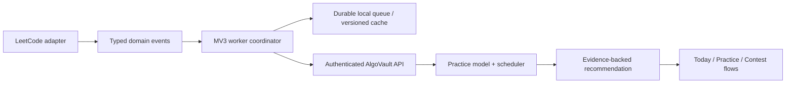

# AlgoVault codebase audit

**Scope.** This is a source-code audit of the repository as it exists on 2 August 2026. I did not use screenshots or mockups as evidence. Scores reflect the implementation, data flow, tests, and the product behaviour those imply. `npm run build` succeeds and `mvn test` passes all 35 tests; that is a useful baseline, not a certification of product correctness.

## 1. Executive summary

AlgoVault has the right ambition and several unusually strong raw ingredients: a local-first LeetCode integration, deliberate-practice telemetry, a real revision scheduler, problem-level rating data, a well-developed curriculum corpus, and an explicit product blueprint. This is not a generic CRUD extension.

The product is not ready to claim it is a competitive-programming operating system. It is currently a promising LeetCode companion with too many overlapping score systems and several trust-breaking implementation gaps. The largest risk is not visual polish; it is that a user makes training decisions from measures that look rigorous but are poorly calibrated, based on insufficient data, or captured without the user deliberately starting a session.

The urgent sequence is: secure identity and credentials; make sync/session state durable and honest; replace pseudo-precision with evidence bands; then simplify the information architecture around one next action. Do not add more features until those foundations are fixed.

## 2. Product vision evaluation

The strongest product decision is already written down in [the v2 blueprint](ALGOVAULT_V2_BLUEPRINT.md): answer “what is the most useful next practice action, and what evidence supports it?” That is a sharper and more defensible wedge than “everything for competitive programming.” The current implementation, however, has eight peer navigation destinations and independently computed ELO, Glicko, virtual rating, solve probability, focus score, Zenith grade, achievements, lists, and contest labels. That is an implementation-led product, not yet an intent-led operating system.

Keep the vision, but narrow the promise: **practice intelligence for LeetCode first; a cross-platform CP operating system later.** The code currently observes LeetCode only. Codeforces and AtCoder are displayed as upcoming-contest providers rather than integrated practice and contest data sources. Calling it a universal CP operating system today will create a promise gap.

## 3. Scores

| Dimension | Score | Why |
|---|---:|---|
| Current product | 5.4 / 10 | A serious feature set, but workflow and measurement trust are unresolved. |
| Product vision | 7.8 / 10 | Clear differentiating thesis; too broad at present. |
| Engineering | 4.8 / 10 | Buildable backend and some thoughtful recovery work, but security, lifecycle, typing, and test coverage are not launch-grade. |
| UX / IA | 5.6 / 10 | Good component intent and transitions; navigation maps to modules rather than user goals. |
| Learning science | 4.6 / 10 | Retrieval practice, self-report, and simulations are present; “mastery” is not measured as transferable retention. |
| Visual design implementation | 6.0 / 10 | A coherent token direction and reduced-motion handling; repeated card density and animation-first ornament are likely to distract. This is code-inferred, not visual QA. |
| Code quality | 4.9 / 10 | Readable in places, but very large components, pervasive `any`, duplicated calculations, and mixed state boundaries. |
| Mathematical correctness | 3.5 / 10 | Individual ideas are reasonable; the current model composition and FSRS implementation are not sufficiently validated for the claims made. |
| World-class readiness | 3.8 / 10 | There is a credible path, not a Linear/Chess.com-level reliable product yet. |

## 4. Verified strengths (top 25)

1. The v2 blueprint articulates evidence, transparency, and progressive disclosure better than most early products.
2. The extension packages successfully with Manifest V3.
3. Backend tests cover core engines and major services; all 35 currently pass.
4. History sync verifies the browser’s signed-in LeetCode account before importing (`extension/background/index.ts:467-470`).
5. Sync pagination has a checkpoint and submission de-duplication strategy.
6. Realtime submissions are also deduplicated by LeetCode ID/tighter tuple.
7. The session tracker handles SPA route changes and cleanup rather than assuming a traditional page load.
8. Cross-world submission messages use a nonce, which is materially better than trusting arbitrary page events.
9. The backend uses a session heartbeat epoch to avoid simple counter resets.
10. The product records self-reported help, an essential input that most trackers omit.
11. The mastery view stores uncertainty (`RD`) rather than only displaying a completion percentage.
12. Solve prediction exposes an insufficient-data state rather than always returning a confident result.
13. The system preserves cached dashboard data while refreshing instead of blanking it.
14. The UI honours `prefers-reduced-motion` globally.
15. ZeroTrac data has local and Redis caching with a fallback provider.
16. Study lists are immediately understandable, practical, and deep-link to work.
17. Pattern content includes triggers, invariants, pitfalls, examples, language variants, and simulations—substantive educational material, not empty labels.
18. The recognition trainer provides immediate explanatory feedback.
19. The simulator permits parameter changes rather than being a pure animation.
20. Revision cards are generated from accepted problems and tied to scheduled review.
21. The system has explicit export functionality.
22. Backend API access is generally authenticated after the auth boundary.
23. Docker binds database, Redis, and backend to loopback by default.
24. The backend cache is evicted on important submission/session changes.
25. The product has a cohesive dark neutral/amber visual language in its shared CSS and UI components.

## 5. Critical engineering and trust findings

### P0 — local authentication grants an account token from a username

`POST /api/auth/extension-login` accepts an arbitrary LeetCode username and returns a JWT for the matching stored user (`backend/.../AuthController.java:73-99`). If that username is already present, the caller receives that user’s token. This contradicts both the “single-user” comment and the security model. At the same time, CORS permits `chrome-extension://*` and defaults to `*` in application configuration (`CorsConfig.java`, `application.yml`). Any local client/extension that can reach the endpoint can impersonate a known account.

**Required change:** remove username-only login entirely. Pair a specific extension installation with a locally generated secret, or require OAuth/device authorization. Restrict CORS to the deployed extension ID(s), fail closed when configured origins are absent, rate-limit authentication, and rotate JWTs. Do not consider this deployable to a shared/network-reachable server until fixed.

### P0 — credentials are stored and returned as ordinary settings

The GitHub PAT is kept in `chrome.storage.local`, sent to `/api/settings`, stored in a JSON preference map, and returned by the settings API (`Settings.tsx:201-210`, `SettingsController.java:30-65`). Chrome local storage is not a credential vault; returning the raw PAT is worse. The `repo` scope requested by the unused OAuth helper is broad.

**Required change:** remove server-side PAT persistence. Prefer GitHub App/OAuth fine-grained tokens, hold a short-lived encrypted token only where necessary, use minimum scopes, and offer a local-only export alternative. Add credential revocation and a clear data/security disclosure.

### P0 — practice time is not trustworthy

The content script starts a backend session unconditionally whenever a matching problem page loads (`session-tracker.ts:282`), despite the dashboard saying focus time is opt-in. The declared `enableSessionTracking`, `enableFocusAnalytics`, and `enablePasteDetection` settings are not consulted by the tracker. The dashboard then increments its live timer from session **start time**, not observed active time (`Dashboard.tsx:202-244`). A session can therefore appear to contain focus while the user is away.

`focusScore = 100 − 5×tabSwitches − 15×pastes` (`SessionService.java:383-385`) treats ordinary research, copy/pasting one’s own template, accessibility tools, or switching to the prompt as moral/skill signals. It is neither a focus measure nor integrity proof.

**Required change:** split **manual focus sessions** from passive problem visits. Start only on explicit user intent; store per-tab/session IDs; record event intervals, not aggregate counters; use `chrome.idle` only as a supplemental signal; persist a durable local event queue; and show “34 active min · 2 interruptions · 1 paste” rather than a score. Let users annotate exclusions. Never call this verification.

### P0 — the browser service-worker lifecycle is not handled as a durable system

Sync recursively awaits a long sequence of network calls and sleeps (`background/index.ts:452-665`). MV3 service workers may terminate between events; there is no `chrome.alarms` coordinator, durable write queue, or replay/idempotency key for messages. The code has some checkpoints, but it still sets `lastSync` after each uploaded batch (`:632`) before a full historical backfill is necessarily complete. Settings may thus present “Full sync valid” after an interrupted partial import.

**Required change:** make a persisted `SyncState` state machine with `lastCompleteAt`, `lastAttemptAt`, provider cursors, partial/error state, immutable snapshot version, and an alarm-driven worker. Queue explicit writes locally with idempotency keys. Present partial history as partial.

### P1 — GitHub OAuth is a dead/broken path

The extension calls `/api/auth/github-exchange` (`extension/lib/api/backend.ts:5-16`), but no backend controller defines that route. `authenticateGithub` has no call site. The live integration instead relies on a manually entered PAT.

**Required change:** delete the unused OAuth path until implemented, or implement code exchange with PKCE/state validation, exact redirect validation, encrypted server storage, and integration tests. A broken auth pathway reduces trust even if currently hidden.

### P1 — permissive Redis polymorphic deserialization

`RedisConfig` activates Jackson default typing with `allowIfBaseType(Object.class)`. Treat Redis as a trust boundary: if its contents are poisoned, permissive polymorphic deserialization is dangerous.

**Required change:** use explicit cache DTOs/serializers and an allow-list of concrete types; do not enable default typing for `Object`.

### P1 — settings are fragmented and some advertised controls are inert

There are local extension defaults, backend columns, and a JSON preference bag. The extension’s telemetry preference types are neither displayed nor enforced; backend validation accepts a different set of options. This creates settings that users can reasonably believe control behaviour but do not.

**Required change:** define a versioned, typed `UserPreferences` contract shared conceptually across client/API; one source of truth per setting; apply settings at event capture, not after the fact; migration/default tests included.

### P1 — no extension automated tests or browser integration fixtures

CI builds the extension but runs no extension test suite. There are no unit tests for content-script routing, message schema, storage migration, DOM adapters, sync interruption/resume, multi-tab behaviour, or LeetCode selector changes. Backend tests use unit/mocked services and do not validate migrations against PostgreSQL or auth/security flows.

**Required change:** add Vitest for pure client logic, Playwright with an unpacked extension and controlled LeetCode fixtures, contract tests for API schemas, Testcontainers PostgreSQL/Redis migrations, and adversarial property tests for ratings/schedulers.

## 6. Mathematical and learning-system audit

### Mastery is an internal estimate, not mastery

The current Glicko model starts each tag from a blend of global contest/virtual rating and 1500, assigns every problem an “opponent” rating, converts eventual AC to 0.7, then displays a lower confidence bound floored at 800 (`MasteryService.java:38-170`). For a new tag the lower bound is dominated by the initial RD; the weakness service nevertheless ranks tags with one attempt as weak (`WeaknessService.java:27-68`). Multi-tag credit changes the score and opponent RD by `sqrt(tagCount)`, a heuristic without a stated statistical interpretation.

This can be useful as an exploratory ranking, but it is not a validated latent-skill measurement. It does not test delayed recall, recognition, implementation fluency, transfer, or independent first-attempt success under controlled conditions.

**Redesign:** model a user’s first independent attempt at the problem level, include recency and assistance as covariates, then aggregate posterior conversion estimates by topic. Require at least 8 attempts for “provisional” and 15 for ordinary topic guidance. Show sample count, time window, assistance mix, and a credible interval. Label small samples “collect evidence,” not “weak.”

### The product has three competing skill models

`TopicRatingService` computes ELO, `MasteryService` computes Glicko-like ratings, `AnalyticsService` fits a logistic virtual rating, and `SolveProbabilityEngine` then uses virtual rating plus tag-mastery priors. They all consume much of the same submission history. They will disagree, cannot validate each other, and invite users to shop for a flattering number.

**Redesign:** retain one user-facing practice-range model. A hierarchical Bayesian/logistic model is ideal later; initially use calibrated conversion bands by difficulty/rating with shrinkage to a global baseline. Keep experimental model outputs behind diagnostics, not the core UI.

### Solve chance is better than a raw guess, but is not calibrated

Gaussian weighted Beta-binomial evidence is a defensible prototype. However its prior uses a virtual rating that is itself fitted on the same data; tag mastery uses related evidence again; output confidence is based on raw count instead of effective weighted sample size; and no Brier score, calibration curve, holdout, or temporal validation is recorded. A `50%` output is therefore presentation precision, not demonstrated forecast accuracy.

**Redesign:** record prediction timestamp/context and resolve against the *first independent outcome*. Evaluate Brier score, log loss, reliability by band, and calibration drift by user. Only expose broad probability bands when the model passes a minimum calibration threshold; otherwise say “building baseline.”

### FSRS is not safe to call FSRS-4.5 as implemented

The scheduler contains valuable ideas—retrievability, stability, difficulty, a retention target—but the coefficient/index comments and equations are internally inconsistent with the documented FSRS parameter roles. For example, `nextDifficulty` uses `W[16]` for mean reversion and `W[6]` for grade update, while its comment describes a different formula; the recall and forgetting branches similarly conflate coefficient roles (`SpacedRepetitionEngine.java:124-190`). The engine stores stability in a legacy `easeFactor` and reconstructs difficulty from a coarse five-level confidence field. No actual user review logs calibrate the scheduler.

**Required change:** either use a tested FSRS reference implementation/data model with verified weights and golden test vectors, or name this an experimental retention scheduler. Persist stability, difficulty, elapsed days, scheduled days, reps, lapses, and state separately. Add known-case regression tests and later fit per-user parameters only after enough reviews.

### Revision checks recognition/self-report more than recall

The dashboard submits a quality rating after a review. There is no enforced retrieval prompt, code reconstruction, invariant explanation, or transfer item before rating. A queue of old accepted problems is not automatically spaced learning. It will become passive “I remember this” checking.

**Redesign:** each review should ask the learner to predict the pattern, state the invariant, reconstruct a compact outline/template, and then compare. Schedule distinct card types: recognition, invariant, failure mode, implementation, and transfer. Score performance separately from self-confidence to expose calibration.

### Pattern Academy has content depth but grants mastery by declaration

The pattern corpus and interactive examples are high-potential. Yet the board’s “mastered” state is a boolean toggled by “Mark Mastered” and stored only in local extension storage (`CurriculumBoard.tsx:24-50`). The trainer score is session-local and its distractors are shuffled with `Math.random`; no performance, misconception, dependency, or retention data survives.

**Redesign:** replace manual mastery with levels: seen → explained → recognized → implemented → retained → transferred. A learner earns a level through evidence, can always override it, and sees why it changed. Build a dependency graph (e.g., prefix sum before subarray sum; BFS/DFS before shortest-path variants) and use it to choose a minimum viable next lesson.

## 7. Feature-by-feature audit

| Feature | Problem solved / likely cadence | Verdict and change |
|---|---|---|
| Today dashboard | Answers what to do now; daily. | Keep, but make one primary action. It currently loads seven sources and turns them into multiple equal-weight cards. |
| Focus session | Captures deliberate practice; daily for some users. | Redesign urgently: explicit intent, active-time intervals, reflection, no focus score. |
| In-page overlay | Adds context at the point of work; every problem. | Flagship candidate. Keep compact and source-attributed; test selectors/routes heavily. |
| Zenith | Protects focused practice; weekly/daily for a subset. | Keep the purpose, remove “verified”/grade claims. Use a private quality summary and user corrections. |
| Submission capture | Makes history timely; every submission. | Keep. Add durable queued delivery, explicit recorded/queued/failed state, and source-capture status. |
| ZeroTrac difficulty | Adds problem calibration; frequent. | Keep with source date and absent-state. Never silently substitute difficulty tiers. |
| Study lists | Reduces choice paralysis; daily. | Keep and make this the default Practice entry. Add “continue,” stop conditions, and deliberate review state. |
| Weakness practice | Finds next training area; weekly. | Redesign thresholding: distinguish underexposed, inconsistent, and underperforming. |
| Mastery | Explains coverage/trend; weekly. | Keep as Topic Evidence, not mastery/ratings until validated. |
| Prediction | Helps choose appropriate challenge; per problem. | Keep experimental. Use broad calibrated bands and show model sufficiency. |
| Revision | Supports retention; daily. | Flagship candidate after active retrieval redesign. |
| Pattern Academy | Teaches pattern recognition; weekly/daily learners. | Flagship candidate. Add dependencies, durable assessments, and transfer tasks. |
| Pattern simulator | Makes state transitions inspectable; on demand. | Keep. Add guided prediction before each step and a “modify input, explain output” task. |
| Contest history | Reflects performance; weekly/biweekly. | Keep official history. Separate official facts from provider estimates. |
| Contest replay | Supports post-contest reflection; monthly. | Keep optional, but call it activity evidence; no cheating classification. |
| Panic/choking/stamina indexes | Suggest contest insights; monthly. | Redesign/remove labels. Current fixed thresholds and timestamps cannot infer psychology. Surface raw behaviours and user reflection. |
| Achievements | Creates occasional delight; infrequent. | Simplify to durable evidence-backed achievements. Current 3D/confetti treatment is too prominent for a learning OS. |
| Celebrations | Confirms an AC; frequent. | Move to optional delight setting. Do not celebrate failures with a punitive meme by default. |
| GitHub sync | Preserves solutions; weekly. | Keep opt-in only after credential/security queue redesign. |
| Resources | Finds external explanations; occasional. | Merge into contextual topic/problem resources; not a top-level destination. |
| Vault | Captures personal notes; frequent for serious users. | Keep contextual. Add searchable typed notes, links to problems/patterns, export, and deletion. |
| Profile overlay | Lightweight progress glance; occasional. | Keep user-invoked only; no second dashboard injection. |
| Heatmap | Identifies rating conversion; weekly. | Keep only if each cell opens a clear action set and displays sample size. |
| Settings | Configures account/sync/integrations; rare. | Redesign around Account, Sync, Privacy, Integrations, Focus, Diagnostics; eliminate `alert()` errors. |
| Multi-platform contests | Motivates scheduling; weekly. | Keep schedule aggregation, but do not imply performance integration for platforms that are not tracked. |

## 8. IA, interaction, accessibility, and performance

### Navigation

The tab bar is technically clean but semantically wrong for the intended product. “Mastery,” “Lists,” and “Learn” are separate destinations for overlapping practice activities. “Heatmap” is a visualization, not a user goal. Consolidate to **Today, Practice, Progress, Contest, Settings** as the blueprint already proposes. Put lists, topics, resources, simulator, and vault in contextual Practice/Problem flows.

### Discoverability and cognitive load

Feature quantity currently requires users to understand the product’s internal taxonomy before beginning. The app must ask less of a first-time user: connect LeetCode, select a goal (contest/interview/foundations), choose a track or complete a baseline, then receive one action. The next action must have “why,” “not now,” and a stated stop condition.

### Interaction and motion

The motion code has good reduced-motion coverage. Retain short tab/content transitions and action confirmations. Remove perpetual legendary glows and non-informational 3D physics from the core progress path. Motion should confirm a solve, explain a state change, or preserve orientation—never compete with reasoning.

### Accessibility gaps

Custom toggle buttons in Settings lack visible labels/states to assistive technology (`aria-pressed`/role semantics); tiny 9–10px text is common; icon-only affordances rely on titles; cards implemented as clickable `div`s are not keyboard-operable; and manually built overlay HTML needs an actual focus trap, Escape handling, labelled controls, and focus restoration. Add keyboard shortcuts only after focus management is correct: `g t` Today, `g p` Practice, `r` review, and `?` shortcut help are useful defaults.

### Rendering and performance

The largest files are not scalable component boundaries: `patterns-data.ts` (~3,177 lines), `PatternSimulator.tsx` (~1,710), `Contest.tsx` (~1,221), `Lists.tsx` (~800), `background/index.ts` (~775), and `session-tracker.ts` (~647). The app loads large feature modules eagerly from `sidepanel.tsx`, and the curriculum does in-memory filtering/rendering without virtualisation. Split routes and data by feature; lazy load modals/simulators/charts; memoize stable rows; virtualize long lists; and move server/cache/client adapters out of UI components.

## 9. Top 25 highest-impact improvements, in order

1. Replace username-only local login with secure extension pairing/OAuth. **Transformational; high complexity.**
2. Eliminate raw GitHub PAT storage/round-trip; use least-privilege, revocable integration. **High; high.**
3. Make manual focus sessions opt-in and redesign telemetry as transparent observations. **Transformational; medium.**
4. Persist an MV3-safe sync/write state machine with idempotency keys and alarms. **High; high.**
5. Declare one canonical user-facing practice model and retire conflicting numeric scores. **Transformational; high.**
6. Rebuild FSRS from a verified reference/data model or downgrade its claim. **High; medium.**
7. Rename Mastery to Topic Evidence until calibrated; impose evidence gates. **High; medium.**
8. Calibrate solve predictions using time-split evaluation and show bands/intervals. **High; high.**
9. Make Today one next action plus evidence and stop condition. **High; medium.**
10. Collapse navigation to Today, Practice, Progress, Contest, Settings. **High; medium.**
11. Convert Pattern Academy to evidence-based levels and dependency-aware learning paths. **Transformational; high.**
12. Turn reviews into active recall, invariant, implementation, and transfer prompts. **Transformational; high.**
13. Implement a typed shared message/API/schema layer; remove `any` and ad hoc strings. **High; medium.**
14. Add extension unit, contract, browser, multi-tab, and service-worker-resume tests. **High; high.**
15. Test PostgreSQL/Redis migrations and auth in CI with containers. **High; medium.**
16. Break up large components/services into feature modules and lazy-loaded routes. **Medium; medium.**
17. Add explicit provider health, source timestamps, stale/partial/offline states. **High; medium.**
18. Reframe Zenith as private deliberate practice; remove verified/cheat language. **High; medium.**
19. Replace panic/choking/stamina labels with evidence and a contest reflection template. **Medium; low.**
20. Build practice paths with diversity constraints and dismissal feedback. **High; high.**
21. Add data deletion, local-only mode, telemetry consent, retention policy, and diagnostics. **High; medium.**
22. Contextualize resources and vault notes inside practice/problem flows. **Medium; medium.**
23. Make study lists the default actionable Practice surface. **Medium; low.**
24. Reduce default achievement catalogue and reserve animation for rare, meaningful unlocks. **Medium; low.**
25. Establish product analytics for outcomes: retention, time-to-next-action, prediction calibration, and improvement—not click volume. **High; medium.**

## 10. Features to redesign, simplify, and elevate

**Redesign:** Focus/Zenith, mastery, weakness detection, solve prediction, revision, pattern mastery, contest psychology indexes, sync state, GitHub integration, Settings.

**Simplify or move out of primary navigation:** Resources, broad achievement gallery, profile overlay, separate Heatmap destination, raw ELO. Keep the underlying capability but place it where it answers a current question.

**Flagship features:**

- **Evidence-backed practice path** — chooses a reachable next problem, explains the reason, gathers an outcome, and changes future recommendations. Daily; high complexity; transformational impact.
- **Pattern Academy with transfer evidence** — teaches triggers/invariants, asks learner-generated explanations, then tests recognition and implementation after delay. Daily/weekly; high; transformational.
- **Private deliberate-practice journal** — transparent active-time/assistance/reflection data, no surveillance score. Daily; medium; high.
- **Contest autopsy** — official facts + per-problem timeline + a concise reflection template and targeted practice path. Biweekly; high; high.

## 11. Missing features worth building

| Feature | User problem / why AlgoVault | Frequency | Complexity | Impact |
|---|---|---|---|---|
| Baseline diagnostic | New users lack personalised evidence. A short stratified first-attempt set creates a defensible start. | Once, then quarterly | High | Transformational |
| Pattern dependency graph | Learners need prerequisite-aware sequencing, not 16 flat patterns. Native content makes AlgoVault unusually suited. | Weekly | High | Transformational |
| Delayed transfer checks | Solving the original problem does not prove transfer. Prompt a structurally similar but surface-different problem later. | Weekly | High | Transformational |
| Error taxonomy | “Wrong answer” is not an insight. Capture bug class: invariant, boundary, complexity, implementation, reading. | Every difficult solve | Medium | High |
| Contest autopsy template | Ratings do not show what to change next contest. Collect chosen/abandoned problems, time allocation, and decision points. | Biweekly | Medium | High |
| Calibration dashboard | Users need to know whether confidence predicts performance; also validates the product models. | Monthly | Medium | High |
| Assisted-to-independent ladder | Editorial learning has value if followed by reconstruction and transfer. Prevents treating help as failure. | Weekly | Medium | High |
| Practice range coverage map | Reveals under-sampling by rating/topic, avoiding false weakness claims. | Weekly | Medium | High |
| Local-first privacy controls | Users need per-signal consent, delete/export, retention, and local-only mode. | Rare but essential | Medium | High |
| Problem decision log | Captures why a pattern was selected/rejected before the solution; supports metacognition. | Daily | Low | High |

## 12. Architecture target

Suggested ownership:

- `extension/src/features/{practice,session,sync,contest,curriculum,settings}` with each feature owning UI, client state, tests, and typed adapters.
- `extension/src/platform/{chrome,leetcode,storage,network}` for all Chrome/message/provider mechanics.
- One message schema (Zod or equivalent) shared by every content script, worker, and sidepanel call.
- Backend packages by bounded context (`identity`, `import`, `practice-model`, `curriculum`, `session`, `export`) rather than mixing controllers/services by technology layer only.
- Store raw immutable events, derived projections, model version, and recommendation explanation separately. Models must be recomputable from source events.

## 13. 90-day roadmap

**Days 0–30 — restore trust.** Fix auth/CORS/secrets/PAT handling; make session tracking explicitly opt-in; add data controls; deploy sync state machine; add extension integration tests; remove false “full sync” language.

**Days 31–60 — make guidance honest.** Collapse IA; ship Today/Practice as a single primary flow; replace scores with evidence bands; gate mastery/prediction recommendations by sample sufficiency; turn the review flow into active retrieval.

**Days 61–90 — create the moat.** Ship a baseline diagnostic, dependency-aware Pattern Academy, assisted-to-independent ladder, and contest autopsy that produces the next practice path. Instrument learning outcomes and validate prediction calibration before expanding feature scope.

## 14. Biggest risks and opportunities

**Risks:** credential/account compromise; users trusting invalid time/mastery/prediction claims; MV3 worker loss causing partial or duplicate data; browser/LeetCode DOM changes without tests; curricular content becoming a polished static handbook rather than a learning loop; and expanding multi-platform claims before data quality exists.

**Opportunities:** no mainstream tool currently combines problem-context overlay, transparent practice evidence, active recall, pattern-recognition assessment, and contest reflection into one coherent loop. The defensible advantage is not an AI chat surface. It is a trustworthy personal dataset plus a learning system that turns each attempt into the next best deliberate practice action.

## 15. Final verdict

AlgoVault has enough original thinking to justify continued investment. Its strongest parts are the product thesis, in-context integration, and learning-content ambition. Its weak point is epistemic discipline: the code frequently turns incomplete observations into authoritative labels and scores.

Treat the next release as **Trustworthy Practice Intelligence**, not as a feature expansion. If you make data collection explicit, models calibrated, explanations inspectable, and learning evidence-based, this can become a product competitive programmers keep open every day. If you keep adding dashboards, scores, and gamification on the current foundation, it will become impressive-looking telemetry that serious users eventually stop believing.
