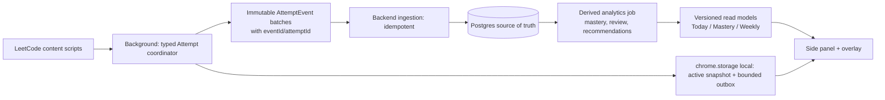

# AlgoVault forensic codebase review

**Audit date:** 2026-08-10  
**Baseline:** current working tree, including pre-existing uncommitted changes. No product code was changed for this review.  
**Scope inspected:** 161 first-party TypeScript/TSX/Java/SQL files (about 25,197 LOC), extension manifest/build wiring, all controllers/services/entities/migrations, all direct Chrome storage keys, external API adapters, and the test suite. Build and tests were run against this baseline.

## 1. Executive Verdict

AlgoVault is an unusually ambitious and promising single-developer competitive-programming companion. It has real product taste: local-first interaction, a useful practice loop, strong submission ingestion, mature empty states, and an actual attempt to make uncertainty visible rather than simply showing vanity stats.

It is **not production-trustworthy yet**. The app currently presents several measurements—practice time, focus, Zenith verification, mastery tier, and recommendation quality—with more certainty than the implementation can defend. There are also two release-blocking backend issues: the default authentication/security configuration is unsafe if the backend is reachable beyond the owner’s machine, and the current `TagMastery.rawRating` entity field has no Flyway migration.

**Overall score today: 6.3/10 as a personal alpha; 3.5/10 as a deployable product.** The right move is not a visual rewrite or another scoring formula. First establish one authoritative event stream and one schema contract. Then the existing UI can become genuinely excellent.

| Area | Verdict | Why |
|---|---:|---|
| Product direction | 8.5/10 | Clear target user and a strong deliberate-practice loop |
| Extension UX | 7/10 | Good hierarchy and useful surfaces; too many competing visual systems |
| Data integrity | 3/10 | Two session systems and duplicating local logs produce conflicting totals |
| Mathematical honesty | 5/10 | Good primitives, but calibration and semantics are inconsistent |
| Backend architecture | 5/10 | Reasonable Spring layering, but unused paths and migration gaps |
| Security/privacy | 2/10 if network-exposed; 6/10 localhost-only | Public token minting, permissive CORS, default secrets, plaintext PAT |
| Test confidence | 4/10 | 36 unit tests pass; critical cross-context behavior has no tests |

**Release gates:** resolve P0-1 and P0-2 before exposing this backend to any network; resolve the timer/data-integrity P1s before describing time, focus, or Zenith as accurate.

## 2. Excellent

- The core user flow is well chosen: sync history → understand weak evidence → review due memory → solve a targeted problem → optionally stretch. The Today implementation in [`Dashboard.tsx`](extension/components/sidepanel/Dashboard.tsx) prioritizes recall before new practice and gracefully falls back to a study list when personal evidence is insufficient.
- Incremental historical sync is thoughtful. [`runSync`](extension/background/index.ts) validates the active LeetCode account, pages solved problems and submissions, retries submission fetches, stores a resumable offset, and deduplicates before the backend upsert.
- Submission interception has meaningful defensive work. [`submission-relay.ts`](extension/contents/submission-relay.ts) validates a page-origin nonce, status codes, and numeric submission IDs; it derives the slug from the URL instead of trusting page payload.
- The Glicko-2 engine has numerical guardrails: capped bracketing/iterations and non-finite input fallback in [`Glicko2MasteryEngine.java`](backend/src/main/java/com/algovault/engine/Glicko2MasteryEngine.java).
- The solve-probability engine is the strongest mathematical subsystem. It uses first attempts per problem, a Gaussian distance kernel, beta-binomial smoothing, an evidence threshold, and exposes its breakdown in [`SolveProbabilityEngine.java`](backend/src/main/java/com/algovault/engine/SolveProbabilityEngine.java).
- Revision scheduling has the right product intent: due queue, learner self-rating, and separate treatment for a contest failure. The UI supports `Forgot / Hard / Good / Easy`; [`RevisionService.java`](backend/src/main/java/com/algovault/service/RevisionService.java) enforces card ownership.
- Backend ownership boundaries are mostly sound. Controllers resolve the authenticated user and pass its ID into services; vault deletion and revision review both re-check ownership.
- The code is notably defensive in places where solo projects are often not: retry/backoff for LeetCode submission pagination, stale cache fallback on Today, error boundaries in the side panel, and backend duplicate submission handling.

## 3. Good

- The extension uses MV3, a background coordinator, isolated content scripts, a main-world bridge, and a local storage abstraction. That is the right foundation.
- The newer APSE session model has a sensible state vector (`RUNNING`, `PAUSED`, `SOLVED`; timestamped active segments; owner tab; capped timeline) in [`EngineKernel.ts`](extension/lib/session-engine/EngineKernel.ts).
- The dashboard’s stale-while-revalidate shape is good in principle: cached `TodaySnapshot` renders first, then seven sources refresh concurrently.
- Weakness recommendations do not prescribe a tag until it has at least three attempted problems in [`WeaknessService.java`](backend/src/main/java/com/algovault/service/WeaknessService.java). That is a useful restraint.
- The backend sync upsert protects against duplicate LeetCode submission IDs and a tighter tuple fallback; current SQL also has useful user/problem and analytics indexes.
- Local logs are bucketed by month plus an index, which is a reasonable storage layout for a future immutable event log.
- There is a useful amount of backend unit coverage for engines and core services. `mvn test` passes all **36 tests**.

## 4. Mediocre

- The side panel is componentized by screen, but the large screens are still monoliths: `Contest.tsx` is 1,221 lines, `Mastery.tsx` 722, `Dashboard.tsx` 711, and `Lists.tsx` 800. Product behavior, fetching, data normalization, and presentation are intertwined.
- TypeScript is declared `strict`, but `any` remains on critical transport/storage paths: session state, local logs, ZeroTrac results, cache snapshots, and runtime messages. Strict mode cannot protect code that opts out of types where consistency matters most.
- There are no ESLint, formatter, unit-test, browser-test, or accessibility-test scripts in [`extension/package.json`](extension/package.json). `npm run build` is the only extension quality gate.
- Refresh semantics vary by screen. Some show cached data then refresh, some silently log errors, and some intentionally swallow a failed API call into an empty list. An empty chart can therefore mean “no data,” “not signed in,” “backend unavailable,” or “request failed.”
- The product has three visual dialects: restrained dark command center (Today), highly ornamented “tier/constellation” mastery, and game/meme overlays. Each can be good, but together they dilute the product’s identity and cognitive focus.

## 5. Actually Bad

1. **P0 — Network-exposed backend can mint identities/tokens without proof of ownership.** `POST /api/auth/extension-login` is public, accepts only a username, and creates or returns a JWT for it in [`AuthController.java`](backend/src/main/java/com/algovault/controller/AuthController.java). Defaults also allow `CORS_ALLOWED_ORIGINS=*` with credentials and set a known JWT secret in [`application.yml`](backend/src/main/resources/application.yml). This is acceptable only for a backend bound to loopback and never exposed; it is not authentication for a hosted service.
2. **P0 — Current mastery worktree will not migrate a fresh/existing database.** [`TagMastery.java`](backend/src/main/java/com/algovault/model/TagMastery.java) maps `raw_rating`, but migrations stop at `V19__add_zenith_sessions.sql`; no migration adds `tag_mastery.raw_rating`. Hibernate will select/insert that column and fail at runtime. Build and mock-based tests cannot see this.
3. **P1 — “Log Time” is an append-only duplicate button, not a checkpoint.** Both dashboard and floating overlay call `session_log_time_v2`; the background archives the full current session but does not mark it logged, checkpoint it, or deduplicate it. Repeated clicks add the same accumulated time repeatedly. A later solve archives it again.
4. **P1 — archived `elapsedSecs` is active-like time while the live UI calls elapsed wall-clock time.** `archivePracticeLog` computes `now - tElapsedStart - accPausedMs`; `deriveClocks` computes elapsed as `now - tElapsedStart`. Thus focused-time ratio in archived logs tends toward 100% and the weekly telemetry disagrees with the floating overlay.
5. **P1 — Zenith “verified” means user-selected grade, not verified behavior.** The start flow writes grade `S_PLUS`, focus score `100`, and no start timestamp. Submission then reads a never-written `algovault.problemStartTime`, so persisted Zenith time is normally zero; the backend sets `isVerified=true` for S+/S/A/B by grade alone.

## 6. Dead Code / Unused

These are confirmed by repository-wide reference searches, not filename guesses.

| Candidate | Evidence | Recommendation |
|---|---|---|
| [`PracticeEventBus.ts`](extension/lib/session-engine/PracticeEventBus.ts) | Class has no imports/callers | Remove, or make it the sole typed event bus before adding more runtime messages |
| [`submission-interceptor.ts`](extension/contents/submission-interceptor.ts) | Registered content script, but body explicitly says it is a no-op | Delete file and manifest registration |
| [`PatternLessonModal.tsx`](extension/components/sidepanel/PatternLessonModal.tsx) | No import outside itself | Remove or wire it deliberately; keep only the active `PatternExhibitModal` path |
| [`SimilarityEngine.java`](backend/src/main/java/com/algovault/engine/SimilarityEngine.java) | Used only by its test class | Remove until a real “similar solved problems” feature consumes it |
| `fetchPotd` and `/api/potd` | API wrapper exists; no extension caller | Either surface POTD or remove endpoint/service/cache |
| `fetchVault` and vault UI API flow | Wrapper has no caller; background only receives `add_to_vault`, with no sender | Vault backend is presently unreachable from the product UI |
| `authenticateGithub` / `exchangeGithubCode` | No caller; backend has no `/api/auth/github-exchange` mapping | Remove incomplete OAuth route or implement end-to-end |
| `startSession`, `fetchCurrentSession`, `endSession` imports in background | Imported but never invoked | Delete legacy backend-session client surface after migration decision |
| `normalizeTimer`, `getLiveTimer`, `setLiveTimer`, `getCurrentSession`, `setCurrentSession` | Defined/imported in the current migration area but not used by live timer | Remove after consolidating storage contract |

## 7. Duplicate / Legacy Systems

| Concept | System A | System B | Consequence |
|---|---|---|---|
| Practice timer | APSE v2 local state in `algovault.session.active` | Spring `sessions` + heartbeat/event API | Two different truths, no replication bridge |
| Focus score | `active / elapsed` in `EngineKernel` | `100 - 5×tabSwitches - 15×pastes` in `SessionService` | Same label, incompatible meanings |
| Session lifecycle | v2 messages (`session_start_v2`, etc.) | Legacy messages and backend REST wrappers | Dead imports and future accidental regressions |
| Mastery | Glicko `tag_mastery` shown in UI | `topic_ratings` Elo recomputation, no UI/API consumer | Duplicated compute cost and contradictory models |
| Recommendation | Today hand-selects review/weakness/study/stretch | POTD independently selects warmup/weakness/revision/stretch | Two ungoverned “next action” algorithms |
| Settings | `chrome.storage.sync`, local storage, backend JSON preferences | Different keys/defaults and partial sync | User cannot know which value is authoritative |
| Zenith timing | APSE timestamps | separate `problemStartTime` key | The second key is never written |

**Decision required:** retain APSE as the client event collector, then persist immutable finalized events to the backend. Do not keep a separate heartbeat session model as a parallel source of truth.

## 8. Broken / Misleading

| User-visible claim | Actual path | Finding | Severity |
|---|---|---|---|
| “Active practice” weekly total | Dashboard combines backend sessions, local logs, live APSE, then recent solves | Same solve can be counted from multiple sources; Log Time multiplies it | P1 |
| “Focused sessions” | Counts each stored local log and backend session | A click, not a distinct session, can increase it | P1 |
| “Elapsed to AC” | `deriveClocks` freezes after local `SOLVED` | Correct only if the APSE transition happened; backend submission and manual Finish can independently archive | P1 |
| “Zenith verified” | User-written grade → backend boolean | No independent evidence, no persisted insight, normally zero duration | P1 |
| “Commit Insight & Exit Zenith” | Text is held only in React state | Insight text is never sent or stored | P2 |
| “Confidence % (RD)” | `100 × (1 - (RD/350)^2)` in Mastery UI | Arbitrary display transform, not a calibrated confidence/probability | P2 |
| “Rock Solid / edge cases” volatility copy | Thresholds on Glicko volatility | Glicko volatility does not diagnose edge-case coding behavior | P2 |
| “Top 1% / top 5%” mastery tiers | Hard-coded tier labels | No population calibration or validation dataset | P2 |
| Sync username mismatch protection | Extension validates active LeetCode user; backend bootstrap accepts any username | Fine for local-owner workflow, unsafe/misleading for hosted auth | P0 if hosted |

## 9. Mathematical

### 9.1 Mastery / Glicko-2 — **good engine, misleading product score**

`Glicko2MasteryEngine` is a competent implementation of a rating update. `MasteryService` creates one result per problem/tag, batches by month, uses first/multi-attempt/help scores, and grows RD during inactive months.

The current score shown as `masteryScore` is **raw rating**, not the conservative lower-confidence bound. In `applyRatingResult`, it is `max(800, rawRating)`; RD is displayed separately. That is a legitimate design only if the UI calls it an *estimate* and visibly qualifies low-evidence tags. It should not be described as conservative mastery.

The current code also **does not use fractional tag attribution**. Every tag on a multi-tag problem receives the full match result. This is defensible if “per-tag evidence” means the problem is evidence for each tag, but it is not defensible to claim that credit is split or that a composite is free from overlap.

The UI composite in [`Mastery.tsx`](extension/components/sidepanel/Mastery.tsx) uses `1 / (RD² + 100)`, not the proposed `n / max(RD,30)²`. It has no sample-size term and combines highly correlated tag ratings (same multi-tag problems) as though independent. Label it **“confidence-weighted topic summary”**, not global power rating.

**Best correction:** store and expose three separate values: `ratingEstimate`, `ratingDeviation`, and `conservativeRating = max(800, ratingEstimate - z×RD)` where `z` is clearly declared (e.g., 1.64 for a one-sided 95% lower bound). Use conservative rating for weakness ranking only after a minimum effective evidence threshold; use raw estimate for a learner-facing trend.

### 9.2 Virtual rating — **reasonable prototype, not calibrated**

`AnalyticsService.recomputeVirtualRating` uses first-attempt outcomes, temporal weighting, L2 regularization, positive-slope projection, convergence checks, and fallback. Those are all good engineering decisions.

Limitations:

- It treats each problem outcome as independent even though many problems/tags are correlated.
- It hard-switches to arbitrary small-sample and extreme-solve-rate heuristics (<10 data points, >95%, <5%) that can jump the rating.
- It does not persist fit diagnostics, standard error/interval, calibration curve, or model version.
- A true LeetCode contest rating overrides the model completely. That makes `virtualRating` change meaning depending on whether the user has attended a contest.

**Classification:** good experimental estimator; not yet a credible global skill number. Expose it as “practice estimate (low/medium/high evidence)” and show sample count/calibration rather than a precision-looking integer alone.

### 9.3 Solve probability — **strongest model, but confidence label is overstated**

Formula implemented:

`posterior = (8×prior + Σ wᵢ×firstAttemptSuccessᵢ) / (8 + Σwᵢ)`, with `wᵢ = exp(-0.5(Δrating/50)²)` for problems within ±100 rating.

This is statistically sensible smoothing. The concern is the reported confidence: it is based on **raw count** (`<8`, `<20`) rather than effective kernel-weighted evidence, even though the engine itself calculates effective weight and a posterior interval. Use effective sample size/interval width for the label. Also log every prediction at open time; otherwise calibration evaluation is biased to whichever predictions happen to be requested.

### 9.4 Spaced repetition — **not proven FSRS-4.5**

The scheduler labels itself FSRS-4.5 and contains 19 weights, but it maps the legacy fields `easeFactor` and `confidence` into stability/difficulty and uses formulas/weight indices that are not validated against an FSRS reference implementation. No user-specific optimizer exists, despite the name suggesting FSRS behavior. Database migration `V7` also declares `confidence`/`interval_days` differently from the entity’s Java types.

**Classification:** modified heuristic inspired by FSRS, not validated FSRS-4.5. Either call it “adaptive review scheduling” or add golden tests against a known FSRS implementation plus an explicit migration to first-class `stability`, `difficulty`, `retrievability`, and `lastReview` fields.

### 9.5 Heatmap and time metrics — **descriptive, not trustworthy performance measurement**

`HeatmapService` computes solve time from first submission to AC, discards values over 120 minutes, and treats zero-minute same-timestamp activity as valid. That measures submission span, not focused solve time. It can be useful as “submission-span proxy” but should never be presented as time-to-solve without qualification.

## 10. Timer

### Actual timer path

`session-tracker.ts` auto-starts an APSE session when a LeetCode problem page is focused. It pauses on visibility/blur, pauses after eight minutes without activity, tracks an owner tab, and counts external pastes. The background serializes transitions using `EngineKernel`. `usePracticeSession` reads that key and ticks locally once per second. Dashboard and floating overlay render its clocks.

This is a strong start, but it is **not robust enough to call accurate**:

1. **Double/triple tab count risk.** A tab change can trigger `tabs.onActivated`, old-document `blur/visibilitychange`, and new-document ownership claim. Each path can increment `tabs`; only transition idempotence prevents duplicate time commits, not duplicate counters.
2. **Restart/suspension overcounts active time.** A persisted `RUNNING` session retains `tActiveStart`; after service-worker/page suspension or browser restart, the next derived clock includes offline time as active until a transition occurs.
3. **Manual finish and Accepted submission race.** `session_finish_v2` archives a solved log; Accepted submission handling independently transitions/archives the matching session. There is no terminal event idempotency key.
4. **Log Time duplicates.** It appends the total each time, with no checkpoint or `lastLoggedActiveMs`.
5. **No source-of-truth transfer to backend.** The backend heartbeat/event architecture is not called by the APSE flow. Thus `/api/sessions/all` typically cannot represent APSE usage.
6. **Paste count has a read-modify-write race.** Two quick paste handlers can read the same storage object and overwrite one another.
7. **The model cannot distinguish “visible but reading” from “active work.”** Mouse move, scroll, and keydown are a reasonable proxy, but it needs user-visible definitions and an idle grace policy.

### Required timer contract

Use one immutable **AttemptEvent** stream. Every event has `eventId`, `attemptId`, `problemSlug`, `occurredAt`, `kind`, `tabId`, and schema version. The background owns transitions and persists a compact snapshot; it uploads batches idempotently. Derive all views from that stream:

- **Elapsed to AC:** `acceptedAt - startedAt`; never subtract pause/idle.
- **Active focus:** sum foreground, non-idle intervals; never infer across a restart/sleep gap.
- **Paused/away:** elapsed minus active; use as transparent context, not punishment.
- **Focus quality:** show `active / elapsed` plus raw tab/idle/paste counts; do not collapse it into one punitive “score.”
- **Practice log:** one terminal record per `attemptId`, or checkpoint deltas carrying `throughActiveMs`; unique constraint/idempotency key prevents duplicates.

### Mental tests that should pass before release

| Scenario | Correct result |
|---|---|
| Start 10:00, background 10:05–10:20, AC 10:30 | elapsed 30m; active ≈15m; away 15m |
| Click Log Time at 5m, 10m, then AC at 15m | daily active total 15m, not 30m or 45m |
| Two problem tabs A/B, switch A→B→A | each gets only its visible interval; switches counted once per real transition |
| Browser restarts while A is running | time after restart is paused/unknown until A is foregrounded again |
| Finish button and Accepted event arrive together | one terminal attempt/log/submission linkage |
| User manually pauses then changes tab | remains manual-paused until explicit resume |

## 11. Recommendation

Today has a sensible priority order: due revision, then weakness recommendation, then study list, then a ZeroTrac stretch. The implementation is product-good but statistically fragmented.

- Review queue has the clearest evidence basis and should stay first.
- Weakness recommendations are tag/rating proximity SQL results, but `WeaknessService` ranks by raw mastery score and does not penalize RD in selection. The UI does show evidence labels in Today, which is good.
- Study list fallback is deterministic and useful, but it is not personalized; label it as a track continuation, which the UI already does.
- Stretch uses contest rating if available otherwise virtual rating, requires 25 solves, and picks the first unsolved ZeroTrac record in `+150..+250`. It has no solve-probability target, novelty/diversity control, or ordering stability.
- POTD duplicates recommendation policy and is unused.

**Best model:** a single `RecommendationCandidate` table/response with explicit `objective` (`review`, `repair`, `build`, `stretch`), evidence, score components, exclusions, model version, and expiration. Ranking should apply hard eligibility first (due review, unsolved, accessible, evidence threshold), then a transparent utility such as:

`utility = learningValue × successBandFit × novelty × evidenceReliability - repetitionPenalty`.

Set stretch by solve probability target (for example 25–45%) rather than a fixed +rating band. That works for both contest-rated and no-contest users.

## 12. Zenith

Zenith is a compelling ritual, but currently it is a **self-declared focus mode**, not an integrity mode.

Trace: `problem-overlay.ts` creates the button and writes local Zenith flags; CSS hides some LeetCode controls; `solve-celebration.tsx` prompts for insight; `submission-relay.ts` sends Accepted; background stamps Zenith fields into submission payload; `SessionService` persists `ZenithSession`.

Problems:

- `algovault.problemStartTime` is read but never written, so time spent is normally `0`.
- `algovault.zenithFocusScore` is set to 100 at start and never updated from APSE.
- Grade is set by user flows, then `isVerified` is calculated from grade value, not telemetry.
- The insight text is discarded.
- Hiding editorial/discussion via text/selectors is brittle against LeetCode DOM/localization changes and cannot prove the user did not use another source.
- Abandon/reload semantics do not finish or clearly classify the underlying attempt.

Keep Zenith, but rename its verified dimension to **“recorded focus conditions”** until telemetry is reliable. Persist `zenithIntent`, start/finish event IDs, acceptance linkage, active/elapsed, visibility intervals, self-reported help, and insight. Call verification “telemetry complete,” not “independently verified.”

## 13. UI / UX

### What works

- Today’s single primary action is the best surface in the product.
- The three-step quest sequence is understandable, and “stretch is optional” is psychologically healthy.
- Cached skeleton/error states are materially better than a blank side panel.
- The problem overlay and floating timer put action near the work context.

### What hurts

- Mastery is visually impressive but over-communicates. Radar chart, rank tiers, confidence arc, stability labels, strongest/weakest orbit, and promotion language all compete before the learner sees the actionable question: “what should I practice and why?”
- Labels such as “Grandmaster,” “Elite 1%,” “Rock Solid,” and “Primary Weakness” make stronger claims than the data supports. For an early-data user they can be demotivating or deceptive.
- Some large pages use very small mono text (7–10px), low-contrast zinc copy, and dense control rows. This is fragile at the 320–450px panel widths the product targets.
- The side panel stores the last tab but accepts arbitrary untyped values from storage. A corrupted/outdated value can select no screen.
- There is no clear data provenance control: users cannot answer “is this number from local APSE, backend sync, LeetCode history, or an estimate?”
- Celebration is a high-interruption modal after every failed submission as well as every AC. Default behavior should be quieter during deliberate practice, with a clear accessibility/reduced-motion preference.

**Design direction:** retain the Today visual language as the system baseline: compact cards, one accent per semantic purpose, readable 11–13px body copy, and evidence chips. Make Mastery an evidence dashboard with one top recommendation, a compact topic list, and an optional “model details” sheet—not a game HUD.

## 14. Backend

The Spring structure is conventional and understandable: controllers resolve user context, services own workflows, repositories own queries, and Flyway owns schema history. That is a good foundation.

Main concerns:

- `SessionService` is a full backend session system with scheduler, event table, heartbeats, optimistic versioning, and focus score—but its intended extension callers are unused. This is maintenance cost without product value.
- `SyncService` makes an external ZeroTrac fetch and a full analytics recomputation in the sync request. For a larger history, this makes a user-facing request long and failure-prone. Make sync ingestion durable, then queue/retry analytics as a job.
- `closeStaleSessions` waits 12 hours then sets `endedAt = startedAt + 1 hour`. This invents an hour of session duration and can mutate old data inaccurately.
- `SettingsController` validates key types but allows a GitHub PAT in server preferences. That duplicates an already sensitive local secret.
- `RedisConfig` enables permissive polymorphic default typing for cached values. Avoid default typing; use typed serializers/DTOs. Redis unavailability is handled for ZeroTrac but not proven for all Spring cache paths.

## 15. Database

| Table | Producer | Consumer | Assessment |
|---|---|---|---|
| `users` | local bootstrap/OAuth/sync | all user-scoped services | Core, but local bootstrap is unsafe when hosted |
| `problems` | sync/realtime submission | mastery, recommendations, heatmap | Core shared catalog |
| `submissions` | sync + real-time relay | nearly all analytics | Core; dual ingestion requires stronger idempotency tests |
| `tag_mastery` | `MasteryService` | Mastery/Weakness/Prediction | Core, currently schema-broken (`raw_rating`) |
| `topic_ratings` | `TopicRatingService` | no UI/API consumer | Legacy/dead product data |
| `revision_cards` | sync/realtime AC | queue/reviews | Core, migrate FSRS state properly |
| `sessions` / `session_events` | backend endpoints | Dashboard `/all` | Orphan architecture; not fed by APSE |
| `problem_open_events` | backend heartbeats/events | mastery/prediction | Mostly empty in APSE operation |
| `user_rating_buckets` | analytics | Heatmap | Derived cache; recompute instead of hand-maintaining incremental complexity |
| `contest_results` | sync | Contest UI/analysis | Good baseline, but contest submission attribution is only within a fixed 90m window |
| `analytics_metrics` | prediction service | evaluation | Valuable if prediction logging is comprehensive |
| `zenith_sessions` | real-time AC | Dashboard grid | Semantics currently unreliable |
| `vault_entries` | no live UI path | no live UI path | Dormant |
| `sync_metadata` / `sync_logs` | sync/realtime | dashboard/settings | Useful operational metadata |
| `user_settings` | settings endpoint | settings | Duplicates Chrome sync/local settings |

Schema issues beyond `raw_rating`:

- `revision_cards.confidence` is `DOUBLE PRECISION` in `V7`, but Java uses `Integer`; `interval_days` is `INTEGER` but Java uses `Double`; dates are mapped as `LocalDateTime`. Explicitly migrate to the intended types rather than relying on JDBC coercion.
- No unique constraint on `zenith_sessions(user_id, problem_id, solved_at)` or an attempt/session linkage. Repeated AC events can create ambiguous records.
- `updated_at DEFAULT NOW()` is not automatically updated by PostgreSQL in most migrations; several fields are therefore “created time,” not actual update time.

## 16. Storage

Chrome local storage is an important persistence layer, but there is no storage schema registry, quota strategy, or clear ownership. The key inventory follows.

| Key / family | Writer(s) | Reader(s) | Frequency / data | Required? | Recommendation |
|---|---|---|---|---|---|
| `algovault.username` | Settings/background sync | all backend client/auth UI | infrequent identity | Yes | Keep; validate one canonical account |
| `algovault.jwt` | OAuth success/local login | backend client/settings | token | Yes for backend | Keep local only; secure bootstrap |
| `algovault.userSettings` | storage helper | settings-related code | local preferences | Partial | Merge or remove in favor of a defined local preference schema |
| `algovault.cache.{dashboard,mastery,heatmap,contests,weakness}` | screens | same screens | stale view cache | Optional | Keep with schema version + TTL + account ID |
| `algovault.todaySnapshot.v2` / legacy `todaySnapshot` | Dashboard | Dashboard | mixed seven-source snapshot | Optional | Keep one versioned record; tag source/account/version |
| `algovault.session.active` | APSE background/tracker | hook/dashboard/floating/storage helpers | mutable active attempt | Yes | Sole active snapshot; type it; do not alias as two APIs |
| `algovault.session.store` | APSE background | APSE background | paused per-slug snapshots | Optional | Replace with attempt index/event store; bounded retention |
| `algovault.logs.YYYY_MM` / `logs.index` | APSE archive | Dashboard | append-only activity log | Yes for local analytics | Add idempotency, cap/prune, schema, migration |
| `algovault.solvedSlugs` | sync/submission/APSE | recommendations/sync | solved cache + raw problems | Optional | Separate lightweight solved index from raw payload; account/version/TTL |
| `algovault.latestSyncedSubmissionTimestamp` / `syncHasMore` / bare `syncStatus` | sync | Settings | sync checkpoint/progress | Yes | Namespace `syncStatus`; atomically bind to account |
| `algovault.zerotrac.{data,last_fetched}.v2` | background | ratings/stretch | external catalog cache | Optional | Keep version/ETag/checksum and size budget |
| `algovault.zerotracState` | Lists | Lists | study-list state | Optional | Type and document |
| `algovault.registeredContests` | UpcomingContests | same | registration list | Optional | Keep account-scoped/versioned |
| `algovault.masteredPatterns` | CurriculumBoard | same | curriculum progress | Optional | Keep; account-scoped |
| `algovault.code_templates` | TemplateVault hook | TemplateVault | local templates | Optional | Keep; export/import path |
| `algovault.github.{pat,repo}` | Settings | background GitHub sync | secret + repo | Optional | PAT should be local only, least-scoped, never backend-synced |
| `algovault.gitSolve.*` / `gitSyncStatus` | background | Settings | full code/readme/metadata per solve | Optional | Avoid retaining code artifact indefinitely; cap/clear after successful sync |
| `algovault.{isZenith,zenithGrade,zenithReason,zenithFocusScore,zenithIntent,problemStartTime,zenithBtnPos}` | overlays | overlay/background | Zenith transient/config | Optional | Replace fragmented flags with one typed `zenithAttempt` record |
| `algovault.requestedTab` / `lastActiveTab` | Dashboard/overlay/sidepanel | sidepanel | navigation | Optional | Validate against tab union; support all requested tabs |

Chrome `storage.sync` also contains `hideAcceptanceRate`, celebration flags/theme. Those values partly sync to backend `preferences`, while `UserSettings` local helper uses different fields. Choose a single owner per preference.

## 17. API

### Internal API map

| Endpoint family | Extension caller | Assessment |
|---|---|---|
| `/api/dashboard`, `/heatmap`, `/mastery`, `/weakness`, `/revision` | side panel | Live and useful |
| `/api/sync/leetcode` | background sync | Live; long-running monolithic request |
| `/api/predict/{slug}` | problem overlay | Live; strong model but no robust prediction-event lifecycle |
| `/api/contests`, `/api/entranthub/*`, `/api/metadata/zerotrac-ratings` | Contest/Today/background | Live, external-service dependent |
| `/api/sessions/*` | only legacy runtime messages for event/heartbeat/submission; core wrappers unused | Architecturally orphaned |
| `/api/vault` | no proven sender/reader | Dormant |
| `/api/potd` | no caller | Dormant |
| `/api/auth/github-exchange` | frontend function only | **Missing backend endpoint** |
| `/api/export/json`, `/api/settings` | Settings | Live |

### External APIs

- LeetCode GraphQL/REST is called from the extension with browser cookies. It is inherently dependent on undocumented endpoint/query behavior and should have feature-level degradation states.
- ZeroTrac is fetched both indirectly through backend and cached client-side. One source/normalizer should own this.
- GitHub writes use a PAT from `chrome.storage.local`; no encryption at rest is available there. Use a fine-grained/revocable token and clearly disclose scope.
- EntrantHub calls should use explicit response schemas and backoff/cache headers, not `any`.

## 18. Performance

- Today refresh fans out to seven operations: backend dashboard/reviews/weakness/sessions, solved slug pagination, ZeroTrac, and contest history. It does this on every dashboard mount and `dashboard_refresh`. Use a backend aggregate endpoint or a stale-aware query cache; avoid fetching the full solved list just to choose one item.
- `get_solved_problem_slugs` can page the entire accepted problem list when its five-minute cache expires. That is unnecessary for normal Today rendering.
- Local logs/index and `gitSolve.*` only grow. `unlimitedStorage` avoids a user-visible quota failure but not startup/memory/performance bloat.
- `MasteryService.computeMastery` rebuilds per-tag groups and loads all problem-open events. `AnalyticsService.recomputeAll` then separately rebuilds mastery, Elo, heatmap, and virtual rating after each sync batch. Batch, profile, and use derived tables/jobs.
- `HeatmapService.recomputeHeatmap` deletes and recreates all bucket rows. Fine for a personal alpha, not for concurrent/network use.
- `Dashboard.tsx` combines all history in render-time memo logic and uses `any` for logs. Move aggregation to a typed selector/service.
- `npm audit --omit=dev --json` currently reports **82 vulnerabilities (76 high)**, predominantly the Plasmo/Parcel toolchain. Upgrade deliberately; do not use an unreviewed blanket `npm audit fix`.

## 19. Security / Privacy

### Must fix

1. Remove default database password and JWT secret from committed defaults; fail startup outside an explicit local-dev profile.
2. Bind local mode to `127.0.0.1` and restrict CORS to the exact installed extension origin(s). A wildcard extension origin and `*` default are not deployment-safe.
3. Replace public username-only extension login with an explicit device-pairing/local secret flow, or require OAuth/PKCE. Never mint a JWT based only on a supplied username.
4. Do not upload/persist GitHub PAT through backend settings. Remove `githubPat` from server preferences; retain only a local, revocable, fine-grained token or implement an OAuth token vault properly.
5. Add rate limits, request size limits appropriate to sync, audit logs, and auth tests.

### Privacy findings

- The extension collects solved problems, all submissions, source code fallback, focus timing, tab switches, paste counts, self-reported help, GitHub credentials, and potentially insight text (though it is currently discarded).
- This is a large behavioral dataset. Provide a data inventory, per-category opt-in (especially code/GitHub/paste telemetry), retention controls, and a local clear-data action. The existing export is good but is not a deletion/control plane.
- No evidence of extension analytics/third-party telemetry was found in source. That is a positive.

## 20. Testing Gaps

Passing tests: extension production build passes; backend `mvn test` passes 36 tests. The gaps are more important than the count.

### Highest-value 20 tests

1. Flyway migration against an empty Postgres database then JPA read/write of every entity (catches `raw_rating`).
2. Flyway upgrade from the prior released schema to current schema.
3. Public auth endpoint cannot mint a user JWT when production profile is active.
4. CORS rejects an arbitrary web origin and accepts only configured extension ID.
5. Timer: visible → hidden → visible yields correct active/elapsed intervals.
6. Timer: browser restart/service-worker suspension never counts downtime as active.
7. Timer: A→B→A tab sequence increments switch counter once per transition and attributes time correctly.
8. Timer: manual pause survives tab change and cannot auto-resume.
9. Timer: idle timeout followed by interaction resumes only the owned current problem.
10. Timer: simultaneous Finish and Accepted yields one terminal event/log.
11. Timer: repeated Log Time produces a cumulative checkpoint, not duplicated totals.
12. Timer: rapid external pastes cannot lose increments.
13. Dashboard aggregation test with local logs + backend session + recent solve does not double count.
14. APSE-to-backend idempotent batch upload/ack/retry after offline period.
15. Zenith start writes start time and final record carries measured active/elapsed, help, insight, and attempt ID.
16. Glicko golden-vector test with known reference values, inactivity, multi-tag policy, and sparse data.
17. FSRS golden vectors against a reference scheduler for all four ratings and multiple reviews.
18. Solve-probability calibration fixture: effective evidence drives confidence/interval, first attempt only, no leakage.
19. Recommendation integration: due review outranks new task; low-evidence tag is exploration not weakness; no solved/premium duplicate candidates.
20. Playwright extension E2E: sync → problem overlay → submit AC → dashboard/heatmap/mastery/revision update.

## 21. Keep

- The Today “one next action” principle and recall-first sequence.
- Local APSE timestamp-vector idea, but make background the sole transition owner.
- First-attempt data discipline in solve probability/virtual rating.
- ZeroTrac metadata as a useful difficulty signal, clearly labeled as external/estimated.
- Cache-first side panel loading, error boundary, and empty-state care.
- Per-user backend authorization boundaries and Flyway as the schema mechanism.
- Resumable history sync and submission dedupe strategy.

## 22. Improve

- Consolidate state and eliminate legacy aliases/messages.
- Add evidence, uncertainty, data-source, and “last calculated” labels to every non-obvious number.
- Split giant components into query hooks, selectors/view models, and presentational components.
- Make settings account-scoped and source-of-truth explicit.
- Add operational dashboards/logging around sync and event ingestion.
- Replace implicit catches-to-empty with typed loading/error/partial states.

## 23. Remove

- The no-op submission-interceptor registration.
- Unused PracticeEventBus, SimilarityEngine, PatternLessonModal, and dormant API surfaces unless a committed feature consumes them.
- Backend session heartbeat architecture after APSE event upload replaces it.
- The GitHub PAT field in backend preferences.
- Unsupported percentile/tier and “verified” language.
- Duplicate `Log Time` buttons until their semantics are made idempotent.

## 24. New Features

1. **Data provenance drawer:** every stat explains source, time range, evidence, and uncertainty.
2. **Attempt timeline:** a human-readable strip of start, active intervals, pauses, submissions, AC, and help report; lets users correct a mis-tracked attempt.
3. **Recommendation rationale:** show objective, solve-probability band, tag evidence, review urgency, and “why not another candidate.”
4. **Calibration page:** predicted vs actual solve probability, Brier score, reliability plot, by evidence band. Hide it until sufficient data.
5. **Weekly review:** actual focused minutes, attempted/solved/reviewed, biggest evidence change, and one next-week commitment—not gamified pseudo-rank.
6. **Data controls:** clear local cache/logs, delete backend data, export includes schema version, turn off code capture/paste telemetry/GitHub integration separately.
7. **Offline outbox:** durable event queue with retry/idempotency/ack state.

## 25. Best Architecture

### Concrete boundaries

- **Extension:** observes browser context; never calculates durable weekly totals from mutable ad-hoc arrays.
- **Background:** owns state machine, assigns `attemptId`, deduplicates terminal events, queues offline writes.
- **Backend ingestion:** append/upsert by `eventId`; never trusts a client-computed focus score as canonical.
- **Analytics worker:** replays events into versioned derived models. Persist `modelVersion`, input count, effective evidence, and generated time.
- **Read API:** serves a single Today aggregate and explicit source/version metadata. UI never merges unrelated authoritative numbers.

## 26. P0–P3 Priorities

| Priority | Work | Outcome |
|---|---|---|
| P0 | Add `raw_rating` migration; migration/JPA integration test | Application can boot against real DB |
| P0 | Lock backend to localhost or implement real auth, exact CORS, secret management | No trivial account/token compromise |
| P1 | Replace duplicated timer/log paths with one attempt event contract | Time/focus/weekly telemetry becomes honest |
| P1 | Fix Zenith start/time/insight/idempotent terminal record | Do not publish false verified stats |
| P1 | Remove or migrate unused backend session system | One source of truth |
| P1 | Decide and document mastery score semantics/overlap policy | Weakness and UI claims align |
| P2 | Replace modified FSRS claim or validate/migrate true FSRS state | Review timing is explainable |
| P2 | Consolidate Today/POTD/recommendation policy | One predictable next-action system |
| P2 | Split large UI components, remove `any`, add lint/format/test scripts | Faster, safer iteration |
| P2 | Dependency upgrade plan following audit | Safer build toolchain |
| P3 | New calibration/provenance/weekly-review features | Differentiated, trustworthy experience |

## 27. 7-day Plan

1. Add and verify Flyway migration for `raw_rating`; audit entity/migration type mismatches.
2. Introduce `local` and `production` profiles; production requires environment secrets and exact CORS; bind local server to loopback.
3. Remove username-only public login from any non-local profile.
4. Disable `Log Time` action and make terminal handling idempotent while the event model is rebuilt.
5. Write timer state-machine tests for tab, idle, restart, double terminal event, and duplicate archive.
6. Persist a single Zenith attempt object with start time and insight, but label it self-reported until telemetry migration is done.
7. Remove proven dead/no-op paths and add CI commands: extension build, backend test, Flyway integration test.

## 28. 30-day Plan

1. Build typed `AttemptEvent`/outbox/ack flow and migrate APSE to it.
2. Replace backend heartbeats/sessions with event-derived attempt/session read models.
3. Build a unified `TodayRecommendation` backend read model with one priority policy.
4. Establish mastery semantics: raw estimate + RD + conservative view + evidence threshold; remove unsupported percentile language.
5. Decide true FSRS implementation versus renamed adaptive scheduler; migrate schema and add golden tests.
6. Remove server-side GitHub PAT persistence; add privacy controls and deletion flow.
7. Split Dashboard, Mastery, Contest, and Lists into smaller typed units; add accessibility and narrow-sidepanel checks.

## 29. 90-day Plan

1. Calibrate recommendation and probability models against stored prediction events; publish evidence bands, not false precision.
2. Add durable job processing for sync/analytics, monitoring, structured error reporting, and backups.
3. Build browser E2E tests for real extension contexts and test against LeetCode DOM fixtures/version drift.
4. Ship weekly reflection and attempt timeline based only on trustworthy event data.
5. If multi-user/hosted remains a goal, complete threat model, OAuth/PKCE/device linking, rate limits, privacy policy, deletion/export, and security review before beta.

## 30. Final Verdict

This is **far better than a typical student solo project in ambition and product instinct**. The best parts are not cosmetic: deliberate-practice framing, first-attempt thinking, Glicko/Bayesian exploration, real ingestion, and a user experience trying to reduce decision fatigue.

The gap to an excellent product is not “make the cards prettier” or “add a more advanced equation.” It is truthfulness under real behavior. Today, the code can compile and show beautiful numbers while the timer double-counts, Zenith time is zero, backend sessions are unused, and a database column is absent. Fix the event/data contracts and deployment security first. Once those are solid, the existing product direction can credibly become a 9/10 personal competitive-programming system.

## Verification record

- `extension: npm run build` — **passed**.
- `backend: mvn test` — **passed: 36 tests, 0 failures/errors**.
- `extension: npm audit --omit=dev --json` — **82 vulnerabilities total, 76 high** (mostly Plasmo/Parcel dependency graph; triage/upgrade required).
- No live database migration run was performed because the audit did not alter or start user data services; the missing `raw_rating` migration is established by entity-to-Flyway comparison.
