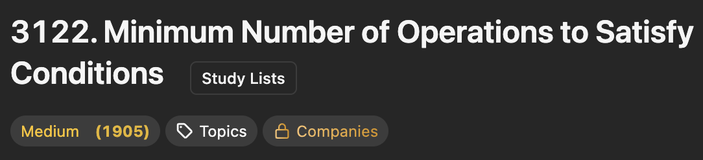
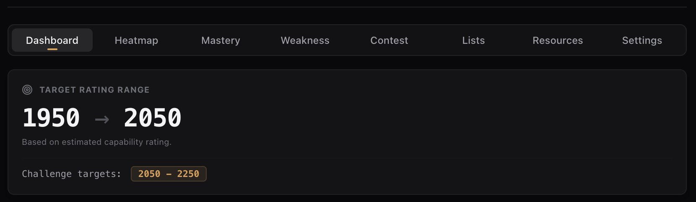
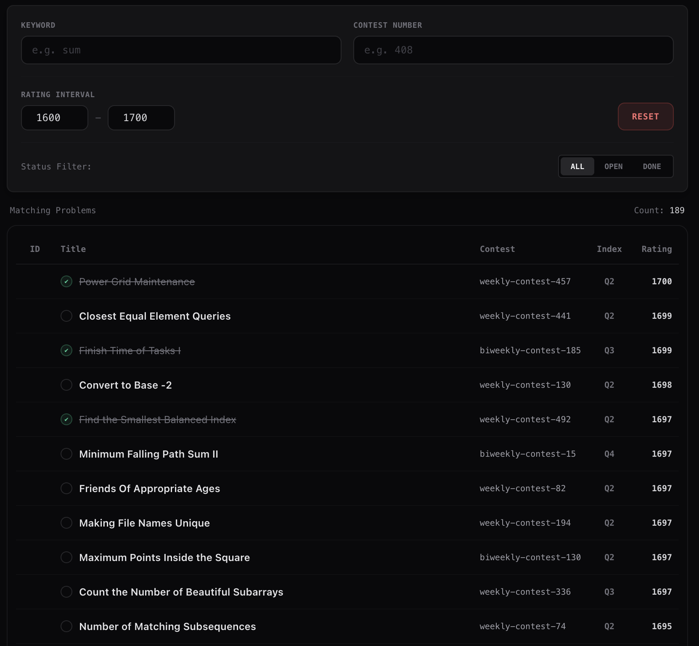
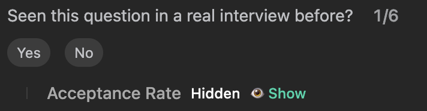
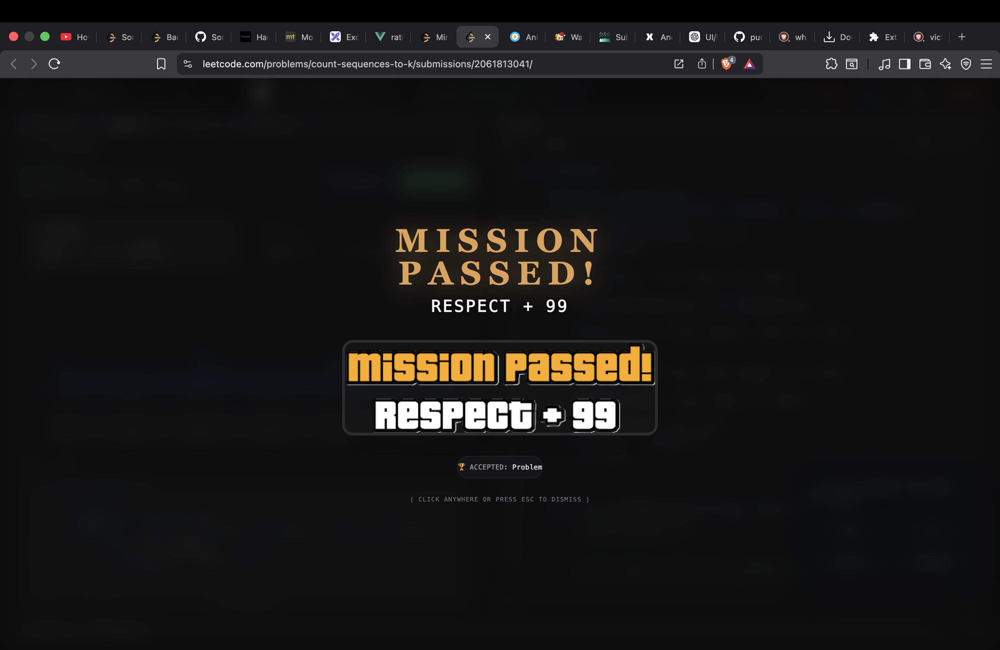
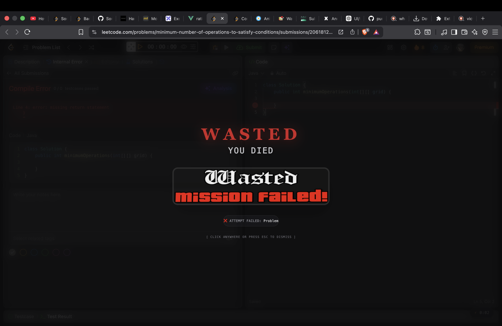
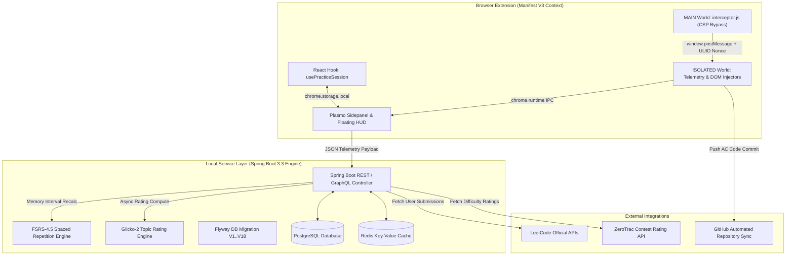

# ⚡ AlgoVault

<h3 align="center">The Competitive Programming & Algorithmic Mastery Operating System</h3>

<p align="center">
  <b>Autonomous Telemetry • Real-Time Engine Math • ZeroTrac Rating HUD • Glicko-2 Skill Modeling • FSRS-4.5 Spaced Repetition</b>
</p>

<p align="center">
  
  
  
  
  
  
  
</p>

---

## 🔬 System Overview & Deep Technical Architecture

**AlgoVault** is a self-hosted, ultra-low-latency performance telemetry suite and cognitive mastery system designed for high-performance competitive coders. It pairs a **Manifest V3 Chrome Extension** with a **Spring Boot 3.3 analytics core**, delivering real-time problem difficulty estimation, automated submission telemetry, distraction-free flow state enforcement, and dynamic memory retrieval.

Unlike simple streak counters, AlgoVault operates an **Autonomous Practice Session Engine (APSE v2)** that monitors microsecond active focus vs. passive elapsed time, detects external code pastes via rolling FNV-1a hash ring buffers, and dynamically models skill decay per topic using **Glicko-2 ratings** and **FSRS-4.5 power-law forgetting curves**.

---

## ⚡ Core Technical Innovations

### 1. Autonomous Practice Session Engine (APSE v2)
- **Deterministic State Machine**: Evaluates session states (`RUNNING`, `PAUSED`, `SOLVED`) across exact pause reasons (`MANUAL`, `TAB`, `IDLE`).
- **Zero-Drift Microsecond Math**: Derives active and elapsed durations dynamically via timestamp origins (`tActiveStart`, `tElapsedStart`, `accActiveMs`, `accPausedMs`), completely bypassing timer drift caused by browser tab throttling or background thread sleep.
- **Cross-Context Real-Time Event Bus**: Dispatches `session_updated_v2` runtime broadcasts to instantly update Sidepanel Dashboard, floating pills, and DOM overlays without polling.
- **Manual Lock Enforcer**: Enforces strict `MANUAL` pause locks so switching tabs or re-focusing pages will **never** trigger unwanted clock auto-resumptions.

### 2. Telemetry & Anti-Cheat Memory Ring Buffer
- **FNV-1a Hash Ring Buffer**: Maintains an in-memory 15-slot rolling hash ring buffer of internal text selections. When a paste event occurs, AlgoVault checks if the hash matches internal selection history—preventing false paste penalties when refactoring code.
- **Focus Score Formula**: Computes live focus quality:
  $$\text{Focus Score} = \min\left(100, \left\lfloor \frac{\text{Active Time}}{\text{Elapsed Time}} \times 100 \right\rfloor \right)$$

### 3. Submissions Interceptor & CSP Bypass (`interceptor.js`)
- **Main World Injection**: Injects `interceptor.js` synchronously at `document_start` via Chrome's Web Accessible Resources (WAR) mechanism, bypassing LeetCode's Content Security Policy (CSP).
- **Security Nonce Bridge**: Leverages random UUID security nonces passed via DOM root attributes to safely bridge intercepted XHR/Fetch `/submissions/detail/*/check` response payloads from the `MAIN` world to `ISOLATED` content scripts.

### 4. Glicko-2 Topic Mastery & FSRS-4.5 Spaced Repetition Engine
- **Glicko-2 Volatility Engine**: Models rating ($R$), Rating Deviation ($\text{RD}$), and Volatility ($\sigma$) per topic tag.
- **FSRS-4.5 Memory Scheduler**: Replaces legacy SM-2 algorithms with power-law retention curves, computing review intervals $I(S, R)$ based on memory stability $S$ and desired retention target $R = 0.90$:
  $$I(S, R) = S \times \left(9 \times \left(\frac{1}{R} - 1\right)\right)^{1/\text{DECAY}}$$

---

## 📸 Comprehensive Visual Showcase

> *All UI components are engineered with bespoke Tailwind styling, dark mode glassmorphism, Framer Motion spring physics, and high-DPI scaling.*

### 📊 1. Main Telemetry Dashboard & Focus Command Center
<table width="100%">
  <tr>
    <td width="50%" align="center">
      <br/>
      <sub><b>Figure 1.1:</b> Daily Quests, Practice Graph & Real-Time Telemetry</sub>
    </td>
    <td width="50%" align="center">
      <br/>
      <sub><b>Figure 1.2:</b> Active Recall Cards & Live Session Bar</sub>
    </td>
  </tr>
</table>

---

### 🏆 2. The Trophy Vault & 3D Badge Cabinet
<table width="100%">
  <tr>
    <td width="100%" align="center">
      <br/>
      <sub><b>Figure 2.1:</b> 3D Parallax Badges Cabinet with Custom Specular Glare & Confetti Physics</sub>
    </td>
  </tr>
</table>

---

### ⚔️ 3. Contest Intelligence, Trajectory & Replay Engine
<table width="100%">
  <tr>
    <td width="50%" align="center">
      <br/>
      <sub><b>Figure 3.1:</b> Contest Performance Summary & Solve Breakdown</sub>
    </td>
    <td width="50%" align="center">
      <br/>
      <sub><b>Figure 3.2:</b> Global Rank Trajectory & Rating Delta History</sub>
    </td>
  </tr>
  <tr>
    <td width="50%" align="center">
      <br/>
      <sub><b>Figure 3.3:</b> Interactive Contest Replay Scrub Bar</sub>
    </td>
    <td width="50%" align="center">
      <br/>
      <sub><b>Figure 3.4:</b> Problem-by-Problem Solve Timeline Replay</sub>
    </td>
  </tr>
  <tr>
    <td colspan="2" width="100%" align="center">
      <br/>
      <sub><b>Figure 3.5:</b> Platform Countdowns (LeetCode, Codeforces, AtCoder)</sub>
    </td>
  </tr>
</table>

---

### 🎯 4. Rating Bands, Mastery Radar & Weakness Discovery
<table width="100%">
  <tr>
    <td width="50%" align="center">
      <br/>
      <sub><b>Figure 4.1:</b> Rating Band Conversion Rate Matrix</sub>
    </td>
    <td width="50%" align="center">
      <br/>
      <sub><b>Figure 4.2:</b> Glicko-2 Skill Distribution Radar</sub>
    </td>
  </tr>
  <tr>
    <td width="50%" align="center">
      <br/>
      <sub><b>Figure 4.3:</b> Weak Topic Identification & Recommendations</sub>
    </td>
    <td width="50%" align="center">
      <br/>
      <sub><b>Figure 4.4:</b> Extension Settings & System Preferences</sub>
    </td>
  </tr>
</table>

---

### 🧠 5. Pattern Curriculum Board & Interactive Simulators
<table width="100%">
  <tr>
    <td width="50%" align="center">
      <br/>
      <sub><b>Figure 5.1:</b> Pattern Curriculum Overview</sub>
    </td>
    <td width="50%" align="center">
      <br/>
      <sub><b>Figure 5.2:</b> Categorized Algorithmic Patterns</sub>
    </td>
  </tr>
  <tr>
    <td width="50%" align="center">
      <br/>
      <sub><b>Figure 5.3:</b> Theory & Invariant Explanations</sub>
    </td>
    <td width="50%" align="center">
      <br/>
      <sub><b>Figure 5.4:</b> Step-by-Step State Simulator</sub>
    </td>
  </tr>
  <tr>
    <td colspan="2" width="100%" align="center">
      <br/>
      <sub><b>Figure 5.5:</b> Visualizer Exhibit (Monotonic Stack / Sliding Window)</sub>
    </td>
  </tr>
</table>

---

### 📚 6. Curated Study Lists (NeetCode 150, Striver SDE & ZeroTrac)
<table width="100%">
  <tr>
    <td width="50%" align="center">
      <br/>
      <sub><b>Figure 6.1:</b> NeetCode 150 Progress Tracker</sub>
    </td>
    <td width="50%" align="center">
      <br/>
      <sub><b>Figure 6.2:</b> Striver SDE Sheet Completion Grid</sub>
    </td>
  </tr>
  <tr>
    <td colspan="2" width="100%" align="center">
      <br/>
      <sub><b>Figure 6.3:</b> ZeroTrac Rating Filter & Problem Index</sub>
    </td>
  </tr>
</table>

---

### 🎯 7. In-Page LeetCode Problem DOM Overlays & Zenith Mode
<table width="100%">
  <tr>
    <td width="50%" align="center">
      <br/>
      <sub><b>Figure 7.1:</b> Injected ZeroTrac Difficulty Rating Tag</sub>
    </td>
    <td width="50%" align="center">
      <br/>
      <sub><b>Figure 7.2:</b> Target Solve Time & Solve Chance HUD</sub>
    </td>
  </tr>
  <tr>
    <td width="50%" align="center">
      <br/>
      <sub><b>Figure 7.3:</b> ZeroTrac Problem Telemetry</sub>
    </td>
    <td width="50%" align="center">
      <br/>
      <sub><b>Figure 7.4:</b> Layout Distraction Stripper (Blind Mode)</sub>
    </td>
  </tr>
</table>

---

### 🎮 8. Submission Verdict Celebrations
<table width="100%">
  <tr>
    <td width="50%" align="center">
      <br/>
      <sub><b>Figure 8.1:</b> GTA V Mission Passed Accepted Celebration</sub>
    </td>
    <td width="50%" align="center">
      <br/>
      <sub><b>Figure 8.2:</b> GTA V Wasted Submission Failure Overlay</sub>
    </td>
  </tr>
</table>

---

## 🏗️ System Architecture & Data Flow



---

## 🧮 Mathematical Foundations & Core Equations

### 1. Practice Estimate (Bayesian Beta-Binomial Prior)
To prevent extreme probability spikes on small sample sizes, solve chances are estimated by combining a rating-based prior $P_{\text{rating}}$ with historical first attempts on comparable problems ($\pm 150$ ZeroTrac points):

$$P = \frac{8 P_{\text{rating}} + \sum \text{First-Attempt Accepts}}{8 + \sum \text{Comparable First Attempts}}$$

### 2. Glicko-2 Topic Skill Update
Your skill rating $R_u$ in a specific topic tag (e.g. *Dynamic Programming*) updates after every solve attempt using Glicko-2 rating variance $v$ and rating deviation $\phi$:

$$v = \left[ q^2 \times g(\phi_p)^2 \times E(R_u, R_p, \phi_p) \times (1 - E(R_u, R_p, \phi_p)) \right]^{-1}$$

$$R_u^{\text{new}} = R_u^{\text{old}} + q \times \frac{1}{\frac{1}{\phi^2} + \frac{1}{v}} \times g(\phi_p) \times \left( S - E(R_u, R_p, \phi_p) \right)$$

* Where $S = 1.0$ for Accepted, $S = 0.0$ for Rejected, and $q = \frac{\ln(10)}{400}$.

### 3. FSRS-4.5 Memory Recall Interval
The interval $I$ (in days) until a problem is scheduled for active recall review is computed using stability $S$ and desired retention $R = 0.90$:

$$I(S, R) = S \times \left( 9 \times \left( \frac{1}{R} - 1 \right) \right)^{1/\text{DECAY}}$$

* Topic Weakness Acceleration: If a topic's Glicko-2 rating lags behind your target rating, an acceleration factor of $0.60\times$ is applied to shrink review intervals and force earlier retrieval practice.

---

## 🛠️ Step-by-Step Installation & Deployment Guide

### 🐳 Option A: Containerized Setup (Docker Compose)
```bash
# 1. Start PostgreSQL 15 & Redis 7 containers
docker-compose up -d postgres redis

# 2. Verify container statuses
docker ps
```

---

### 💻 Option B: Native Infrastructure Setup

#### 🍏 macOS Setup
```bash
# 1. Install PostgreSQL 15 and Redis
brew install postgresql@15 redis

# 2. Start native services
brew services start postgresql@15
brew services start redis

# 3. Create target database
createdb algovault
```

#### 🪟 Windows Setup (WSL2 + PostgreSQL)
1. Install **PostgreSQL 15** from the [Official Download Page](https://www.postgresql.org/download/windows/). Set password to `algovault_dev`.
2. Install **Redis** inside WSL2 Ubuntu:
   ```bash
   sudo apt update && sudo apt install redis-server -y
   sudo service redis-server start
   ```
3. Create database in `psql` or `pgAdmin`:
   ```sql
   CREATE DATABASE algovault;
   ```

#### 📁 Linux (Ubuntu/Debian) Setup
```bash
sudo apt update && sudo apt install postgresql postgresql-contrib redis-server -y
sudo systemctl start postgresql && sudo systemctl enable postgresql
sudo systemctl start redis-server && sudo systemctl enable redis-server
sudo -u postgres createdb algovault
```

---

### 🚀 Launching AlgoVault

#### 1. Start the Spring Boot Analytics Engine
```bash
cd backend
export SPRING_DATASOURCE_PASSWORD=your_password
./mvnw spring-boot:run
```
*Flyway migrations automatically execute schema scripts (`V1` to `V18`). API service listens at `http://localhost:8080`.*

#### 2. Build & Load the Chrome Extension
```bash
cd extension
npm install
npm run build
```
To load into Chrome:
1. Open `chrome://extensions/`
2. Enable **Developer Mode** (top-right toggle).
3. Click **Load Unpacked** and select `extension/build/chrome-mv3-prod/`.

---

<p align="center">
  <b>Built for competitive programmers striving for Knight, Guardian, & Grandmaster ranks. ⚔️</b>
</p>
