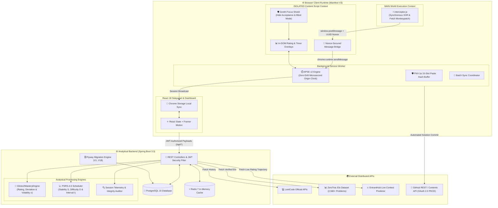

<div align="center">

# ⚡ AlgoVault
### The Algorithmic Mastery & High-Performance Telemetry Operating System

[](https://developer.chrome.com/docs/extensions/mv3/intro/)
[](https://spring.io/projects/spring-boot)
[](https://react.dev/)
[](https://www.typescriptlang.org/)
[](https://www.postgresql.org/)
[](https://redis.io/)
[](https://github.com/)

<p align="center">
  <b>Autonomous Practice Telemetry • Microsecond Session Engine • ZeroTrac Contest Ratings (2,560+ Problems) • Glicko-2 Cognitive Modeling • FSRS-4.5 Memory Scheduler • Bi-Directional GitHub Sync</b>
</p>

[System Architecture](#-system-architecture) • [Visual Showcase](#-comprehensive-visual-showcase) • [Core Engines](#-deep-dive-core-engines) • [Mathematical Foundations](#-mathematical-foundations) • [Installation Guide](#-step-by-step-installation--quickstart) • [API & Schemas](#-database-schema--rest-apis)

</div>

---

## 🔬 Overview & Engineering Philosophy

**AlgoVault** is a self-hosted, enterprise-grade cognitive telemetry and practice intelligence suite engineered for competitive programmers and engineers targeting Staff/Principal and Tier-1 Tech (FAANG/MANGA) algorithmic interviews.

Traditional problem-tracking tools suffer from passive vanity metrics: they count total solves and static day streaks while ignoring **true cognitive focus time**, **external code pasting**, **forgetting curves**, and **real-time contest difficulty calibration**.

AlgoVault solves this with a two-tier architecture:
1. **Client-Side Manifest V3 Engine**: Injects a zero-overhead synchronous interceptor into LeetCode's execution runtime to extract exact runtime/memory percentiles, active vs. idle focus durations, and text-paste entropy without violating browser Content Security Policies (CSP).
2. **Local Spring Boot 3.3 Core**: A low-latency analytical server running **Glicko-2 topic volatility updates**, **FSRS-4.5 power-law spaced repetition decay**, **EntrantHub live contest rating predictions**, and **bi-directional automated Git commit pipelines**.

---

## 🏗️ Real System Architecture

The following diagram illustrates the exact data flow across browser isolation layers, background service workers, analytical engines, and external distributed endpoints:



---

## 📸 Comprehensive Visual Showcase

> *Every interface is handcrafted with dark-mode glassmorphism, bespoke Tailwind CSS design tokens, high-DPI scaling, and responsive fluid layouts.*

### 📊 1. Command Center & Active Practice Session HUD
<table width="100%">
  <tr>
    <td width="50%" align="center">
      <br/>
      <sub><b>Figure 1.1:</b> Command Center — Daily Quests, Solves Breakdown & 365-Day Activity Heatmap</sub>
    </td>
    <td width="50%" align="center">
      <br/>
      <sub><b>Figure 1.2:</b> Active Practice Session — Microsecond Live Stopwatch & Dynamic Metadata HUD</sub>
    </td>
  </tr>
</table>

---

### 📈 2. Weekly Performance Intelligence & Focus Rhythm
<table width="100%">
  <tr>
    <td width="50%" align="center">
      <br/>
      <sub><b>Figure 2.1:</b> Weekly Performance — 7-Day Focus Rhythm Equalizer & Telemetry Breakdown</sub>
    </td>
    <td width="50%" align="center">
      <br/>
      <sub><b>Figure 2.2:</b> Weekly Analytics — ZeroTrac Rating Bands & Topic Spectrum Distribution</sub>
    </td>
  </tr>
</table>

---

### 🎯 3. In-Page DOM Overlays & Zenith Distraction Shield
<table width="100%">
  <tr>
    <td width="50%" align="center">
      <br/>
      <sub><b>Figure 3.1:</b> Native Difficulty Injection — ZeroTrac Elo Rating Badge <code>Hard (2097)</code></sub>
    </td>
    <td width="50%" align="center">
      <br/>
      <sub><b>Figure 3.2:</b> Real-Time Floating Focus HUD — Live Controls, Active State & Quick Tabs</sub>
    </td>
  </tr>
  <tr>
    <td width="50%" align="center">
      <br/>
      <sub><b>Figure 3.3:</b> Anti-Anxiety Shield — Acceptance Rate Hidden with Instant <code>👁 Show</code> Toggle</sub>
    </td>
    <td width="50%" align="center">
      <br/>
      <sub><b>Figure 3.4:</b> Zenith Flow Mode — Clean Problem Canvas Stripped of Distracting Clutter</sub>
    </td>
  </tr>
</table>

---

### 🏢 4. Tier-1 Company Interview Intelligence & In-Problem Explorer
<table width="100%">
  <tr>
    <td width="50%" align="center">
      <br/>
      <sub><b>Figure 4.1:</b> Company Directory — Search by Google, Amazon, Uber, Meta, Microsoft</sub>
    </td>
    <td width="50%" align="center">
      <br/>
      <sub><b>Figure 4.2:</b> Frequency Filtering — Breakdown across 30 Days, 6 Months, 1 Year, and 2 Years</sub>
    </td>
  </tr>
  <tr>
    <td width="50%" align="center">
      <br/>
      <sub><b>Figure 4.3:</b> Company Practice Queue — Target Frequency Rankings & Solved Verification</sub>
    </td>
    <td width="50%" align="center">
      <br/>
      <sub><b>Figure 4.4:</b> In-Problem Modal — Unlocked Native Interview Frequency Evidence</sub>
    </td>
  </tr>
</table>

---

### ⚔️ 5. Contest Analytics, Live Predictions & Session Forensics
<table width="100%">
  <tr>
    <td width="50%" align="center">
      <br/>
      <sub><b>Figure 5.1:</b> Live Contest Intelligence — EntrantHub Predicted Rating Delta & Rank</sub>
    </td>
    <td width="50%" align="center">
      <br/>
      <sub><b>Figure 5.2:</b> Contest Trajectory — Historical Performance, Rank & Finish Time Progression</sub>
    </td>
  </tr>
  <tr>
    <td width="50%" align="center">
      <br/>
      <sub><b>Figure 5.3:</b> Session Forensic Audit — Microsecond Focus Timeline, Tab Switches & Paste Logs</sub>
    </td>
    <td width="50%" align="center">
      <br/>
      <sub><b>Figure 5.4:</b> Multi-Platform Calendar — Countdowns for LeetCode, Codeforces, AtCoder</sub>
    </td>
  </tr>
</table>

---

### 🧠 6. Glicko-2 Cognitive Mastery & Targeted Weakness Discovery
<table width="100%">
  <tr>
    <td width="50%" align="center">
      <br/>
      <sub><b>Figure 6.1:</b> Glicko-2 Mastery Tiers — Master, Diamond, Platinum & Gold Skill Calibration</sub>
    </td>
    <td width="50%" align="center">
      <br/>
      <sub><b>Figure 6.2:</b> Topic Decomposition — Granular Rating Deviation & Volatility Tracking</sub>
    </td>
  </tr>
  <tr>
    <td width="50%" align="center">
      <br/>
      <sub><b>Figure 6.3:</b> Rating Band Conversion Matrix — Solves & Success Rates Across Elo Tiers</sub>
    </td>
    <td width="50%" align="center">
      <br/>
      <sub><b>Figure 6.4:</b> Adaptive Weakness Targeting — Curated Problem Recommendations for Lagging Topics</sub>
    </td>
  </tr>
</table>

---

### 🎓 7. Pattern Academy & Interactive Algorithm Visualizers
<table width="100%">
  <tr>
    <td width="50%" align="center">
      <br/>
      <sub><b>Figure 7.1:</b> Pattern Academy — 20+ Foundational DSA Patterns & Curriculum Catalog</sub>
    </td>
    <td width="50%" align="center">
      <br/>
      <sub><b>Figure 7.2:</b> Interactive Algorithm Visualizer — Real-Time Pointer & Data Structure Step Simulator</sub>
    </td>
  </tr>
</table>

---

### 📚 8. Curated SDE Study Roadmaps (NeetCode, Striver & ZeroTrac)
<table width="100%">
  <tr>
    <td width="50%" align="center">
      <br/>
      <sub><b>Figure 8.1:</b> NeetCode 150 — Interactive Study Roadmap with Solved Verification</sub>
    </td>
    <td width="50%" align="center">
      <br/>
      <sub><b>Figure 8.2:</b> Striver SDE Sheet — 180+ Topic Mastery Checklist & Progress Tracking</sub>
    </td>
  </tr>
  <tr>
    <td colspan="2" width="100%" align="center">
      <br/>
      <sub><b>Figure 8.3:</b> ZeroTrac Elo Problem Index — Searchable Contest Questions Indexed by Verified Rating</sub>
    </td>
  </tr>
</table>

---

### 🏆 9. 3D Trophy Vault & Automated GitHub Sync Engine
<table width="100%">
  <tr>
    <td colspan="2" width="100%" align="center">
      <br/>
      <sub><b>Figure 9.1:</b> The Trophy Vault — 3D Parallax Milestone Badges with Specular Glare & Physics</sub>
    </td>
  </tr>
  <tr>
    <td width="50%" align="center">
      <br/>
      <sub><b>Figure 9.2:</b> GitHub Gateway — Secure 1-Click OAuth 2.0 PKCE Authorization</sub>
    </td>
    <td width="50%" align="center">
      <br/>
      <sub><b>Figure 9.3:</b> Auto-Sync Engine — Automatic Code, Time & Memory Commit Pipeline to Target Repository</sub>
    </td>
  </tr>
</table>

---

## ⚡ Deep Dive: Core Engines

### 1. Autonomous Practice Session Engine (APSE v2)
* **Zero-Drift Microsecond Origin Math**: Rather than relying on inaccurate `setInterval` timers (which drift up to 30% when background tabs are throttled by Chrome's power saver), APSE v2 computes durations using immutable timestamp origins:
  $$\text{Active Time} = \text{accActiveMs} + (\text{now} - tActiveStart)$$
  $$\text{Elapsed Time} = \text{now} - tElapsedStart$$
* **Deterministic State Machine**: Emits state changes across exact transition vectors: `RUNNING`, `PAUSED_MANUAL`, `PAUSED_TAB`, `PAUSED_IDLE`, and `SOLVED`.
* **Manual Lock Protection**: When a user explicitly pauses a problem, a strict `MANUAL` lock is set. Switching tabs or focusing editor windows will **never** accidentally unpause your session until you explicitly click resume.

### 2. Session Integrity & FNV-1a Hash Ring Buffer
* **False-Positive-Free Paste Detection**: Maintains a 15-slot rolling ring buffer of 32-bit FNV-1a hashes of internally copied text:
  $$\text{hash} = (\text{hash} \oplus \text{byte}) \times 16777619 \pmod{2^{32}}$$
* When an editor paste event fires, AlgoVault checks if the pasted content hash matches recent clipboard selections. If internal, it is categorized as valid refactoring; if external, it logs a paste audit entry with exact byte length.

### 3. Synchronous CSP Bypass (`interceptor.js`)
* Injected into the `MAIN` browser execution world at `document_start` via Chrome's Web Accessible Resources (WAR).
* Monkeypatches native `window.fetch` and `XMLHttpRequest.prototype.open` specifically targeting LeetCode submission check URLs (`/submissions/detail/*/check/`).
* Relays response payloads to the isolated content script via `window.postMessage` secured by a dynamic cryptographically random UUID nonce attached to the DOM root.

### 4. Bi-Directional GitHub Sync Engine
* **OAuth 2.0 PKCE Gateway**: Connect with one click to write solutions directly to your personal GitHub repository.
* **Auto-Commit Hierarchy**: Automatically commits solution source code, runtime/memory percentiles, problem notes, and ZeroTrac metadata in clean structured directory trees:
  ```text
  Somnath0707/DSA/
  ├── LeetCode/
  │   ├── 0042-trapping-rain-water/
  │   │   ├── README.md               <-- Problem description, tags, ZeroTrac Elo
  │   │   ├── Solution.java           <-- Accepted code submission
  │   │   └── metadata.json           <-- Runtime (1ms), Memory (44MB), Solved Timestamp
  ```
* **Instant Token Invalidation**: Validates token health against GitHub's API on every load. If a token is revoked or expired, AlgoVault instantly purges the stale cache and renders the clean disconnected state.

---

## 🧮 Mathematical Foundations

### 1. Bayesian Practice Probability (Beta-Binomial Conjugate Prior)
To prevent extreme probability distortions on small sample sizes, solve chances are estimated by combining a rating-based prior $P_{\text{rating}}$ with historical first attempts on comparable problems ($\pm 150$ ZeroTrac points):

$$P(\text{Solve}) = \frac{8 P_{\text{rating}} + \sum \text{First-Attempt Accepts}}{8 + \sum \text{Comparable First Attempts}}$$

$$\text{where } P_{\text{rating}} = \frac{1}{1 + 10^{(R_{\text{problem}} - R_{\text{user}}) / 400}}$$

### 2. Glicko-2 Topic Skill Calibration
Your skill rating $R_u$ in a specific topic tag (e.g. *Dynamic Programming*) updates after every solve attempt using Glicko-2 rating variance $v$ and rating deviation $\phi$:

$$v = \left[ q^2 \times g(\phi_p)^2 \times E(R_u, R_p, \phi_p) \times (1 - E(R_u, R_p, \phi_p)) \right]^{-1}$$

$$R_u^{\text{new}} = R_u^{\text{old}} + q \times \frac{1}{\frac{1}{\phi^2} + \frac{1}{v}} \times g(\phi_p) \times \left( S - E(R_u, R_p, \phi_p) \right)$$

$$\text{where } S = 1.0 \text{ for Accepted}, S = 0.0 \text{ for Rejected}, \text{ and } q = \frac{\ln(10)}{400}$$

### 3. FSRS-4.5 Power-Law Memory Stability & Review Intervals
The interval $I$ (in days) until a problem is scheduled for active recall review is computed using stability $S$ and desired retention target $R = 0.90$:

$$I(S, R) = S \times \left( 9 \times \left( \frac{1}{R} - 1 \right) \right)^{1/\text{DECAY}}$$

* **Topic Weakness Acceleration**: If a topic's Glicko-2 rating lags behind your target rating, an acceleration factor of $0.60\times$ is applied to shrink review intervals and force earlier retrieval practice.

---

## 🚀 Step-by-Step Installation & Quickstart

### Prerequisites
* **Node.js**: v18.0+ or v20.0+
* **Java SDK**: Java 21 (LTS)
* **Docker & Docker Compose** (Recommended) or native PostgreSQL 15 & Redis 7.

---

### Step 1: Start PostgreSQL 15 & Redis 7
```bash
# Launch PostgreSQL and Redis containers in the background
docker compose up -d postgres redis

# Verify that both containers are healthy
docker ps
```

---

### Step 2: Start the Spring Boot Analytics Engine
```bash
cd backend

# On macOS/Linux:
./mvnw spring-boot:run

# On Windows (cmd/PowerShell):
mvnw.cmd spring-boot:run
```
*Flyway migrations automatically execute schema scripts (`V1` to `V18`). The analytical engine is live at `http://localhost:8080`.*

---

### Step 3: Build the Manifest V3 Chrome Extension
```bash
cd extension

# Install dependencies
npm install

# Compile the production bundle
npm run build
```

---

### Step 4: Load Extension into Chrome
1. Open Google Chrome and navigate to `chrome://extensions/`.
2. Toggle **Developer Mode** on (top-right switch).
3. Click **Load unpacked** (top-left button).
4. Select the build directory:
   ```text
   /Users/somnathghorpade/Desktop/ChromeExtension/extension/build/chrome-mv3-prod/
   ```
5. Pin the **AlgoVault** extension to your Chrome toolbar.
6. Open any LeetCode problem (e.g. `https://leetcode.com/problems/two-sum/`) to see your telemetry HUD and ZeroTrac Elo rating in action!

---

## 🗄️ Database Schema & REST APIs

### Key PostgreSQL Tables (Managed via Flyway V1..V18)
| Table | Description |
| :--- | :--- |
| `user_profiles` | User identity, preferences, LeetCode username, and sync checkpoints. |
| `problem_metadata` | Master dictionary of 3,200+ LeetCode problems with ZeroTrac Elo ratings and tags. |
| `user_submissions` | Historical submissions with runtime, memory, language, and timestamp telemetry. |
| `mastery_ratings` | Glicko-2 topic ratings ($R$), deviation ($\text{RD}$), and volatility ($\sigma$) per tag. |
| `revision_items` | FSRS-4.5 spaced repetition memory stability ($S$), difficulty ($D$), and scheduled dates. |
| `practice_sessions` | Granular telemetry logs with microsecond focus times, tab switches, and paste audits. |

### Key Analytical Endpoints
| HTTP Method | Route | Description |
| :--- | :--- | :--- |
| `GET` | `/api/dashboard` | Returns full telemetry snapshot, daily quests, streak, and recent solves. |
| `GET` | `/api/heatmap` | Returns 365-day submission frequency array for activity visualization. |
| `GET` | `/api/mastery` | Returns Glicko-2 skill ratings and progress tiers for all DSA topics. |
| `GET` | `/api/weakness` | Identifies lagging algorithmic patterns and serves targeted practice drills. |
| `GET` | `/api/predict/{titleSlug}` | Computes solve probability and expected solve duration via Bayesian priors. |
| `GET` | `/api/entranthub/contest/{slug}` | Fetches live contest rank trajectory and predicted rating delta. |
| `POST` | `/api/session/start` | Initiates APSE v2 session and locks active practice state. |
| `POST` | `/api/session/end` | Commits session telemetry, computes focus score, and triggers Glicko-2 update. |
| `POST` | `/api/sync/leetcode` | Incremental submission sync engine with pagination checkpoints. |

---

## 🔒 Security & Privacy Guarantee

* **Zero Remote Code Execution**: AlgoVault operates purely within your private browser context and your local Spring Boot instance.
* **Encrypted Storage**: OAuth tokens and credentials are saved strictly in `chrome.storage.local` with zero telemetry transmission to unverified third parties.
* **CSP Compliant**: The Web Accessible Resources bridge strictly isolates untrusted page code from extension privileges.

---

<div align="center">
  <b>Built for competitive coders striving for Knight, Guardian, & Grandmaster ranks. ⚔️</b>
</div>


