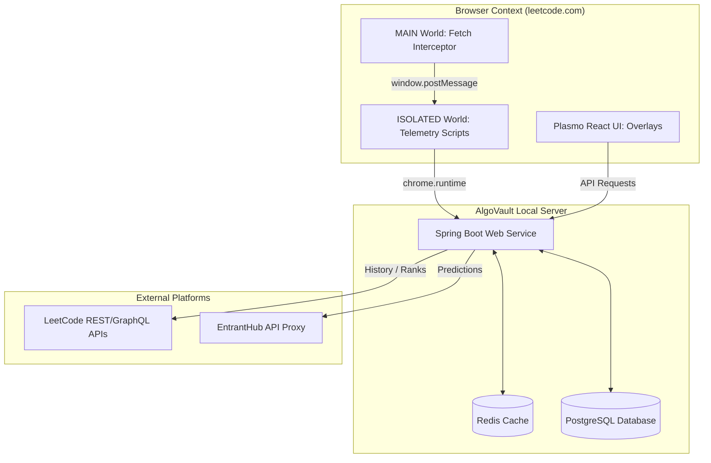

# ⚡ AlgoVault

> **Your Competitive Programming Operating System.**

AlgoVault is a self-hosted performance telemetry, rating estimation, and algorithmic mastery tracker. It works via a lightweight, high-performance Chrome Extension (Manifest V3) that intercepts and collects problem statistics in real-time, backed by a Spring Boot analysis service that models your cognitive skill levels per topic.

---

## ✨ Key Features & Capabilities

* **📊 Contest Intelligence & Timeline**:
  * Track official LeetCode rating trajectories, peak ratings, global ranks, and average rating deltas.
  * Interactive solve breakdown distribution bars ($4/4$, $3/4$, $2/4$, $1/4$, $0/4$) and filter chips (*All*, *Gains*, *Sweeps*, *Milestones*, *Weekly*, *Biweekly*).
  * Expandable contest detail drawers and live upcoming contest countdowns across LeetCode, Codeforces, and AtCoder.

* **🏆 The Trophy Vault & Achievement Showcase**:
  * 3D parallax trophy tilt physics (`preserve-3d` and Framer Motion spring physics) with specular glare filters.
  * Custom spotlight beams and floating sparkles for **Legendary** tier badges (*CR7*, *Number 10 / Messi*, *All Kill*, *Guardian*, *Ultra Instinct*).
  * Interactive particle confetti explosions (`canvas-confetti`) on trophy clicks.
  * Real-time locked badge progress indicators (e.g., `1850/2180 rating (85%)` or `700/1000 solved (70%)`).

* **🎯 Today's Quests & Live Focus Timer**:
  * Live-ticking focus session timer with start/pause/end session controls.
  * Curated Spaced Review cards (FSRS-4.5 algorithm), Recommended Practice, and Stretch Targets.
  * 7-day activity bar charts and at-a-glance telemetry stats.

* **⚔️ Zenith Cinematic Focus Mode**:
  * Strips away navbars, sidebars, topics, and problem tags for complete immersion in deep work.
  * Intentional Reveal: Editorial and Solution tabs require holding the `🔒 Yield & Reveal` button for 2 seconds.
  * Flow State Timer that pulses amber after 25 minutes of continuous focus.

* **🎮 Submission Celebration Overlays**:
  * Authentic GTA (*Mission Passed* / *Wasted*) or Minecraft (*Level Up* / *You Died*) themes with audio chimes on accepted/rejected submissions.

* **🧩 Pattern Simulator & Study Lists**:
  * Interactive step-by-step pattern simulators (Monotonic Stack, Sliding Window, Two Pointers).
  * 1-click progress tracking for **NeetCode 150**, **Striver SDE Sheet**, and **ZeroTrac Rating Filters**.

---

## 📸 Visual Showcase & Feature Tour

### 📊 Performance Analytics & Sidepanel Dashboard
AlgoVault provides a unified sidepanel dashboard displaying daily quests, active focus session controls, 7-day activity metrics, and cognitive loading telemetry.

<p align="center">
  
</p>

<p align="center">
  
  
</p>

---

### 🎮 The Trophy Cabinet & Progress Heatmap
A premium display case designed with emotional craftsmanship featuring 3D badge parallax tilts, tier shelves (Common, Rare, Epic, Legendary), and a dynamic height Solve vs Attempted rating band chart.

<p align="center">
  
  
</p>

---

### ⚔️ Contest Performance & Trajectory Analytics
Track upcoming contests across platforms, monitor live contest metrics, analyze rating trajectory area graphs, and inspect performance per contest.

<p align="center">
  
  
</p>

<p align="center">
  
  
</p>

---

### 🏆 Interactive LeetCode Overlays & Rating Badges
AlgoVault injects beautiful UI overlays directly onto LeetCode problem pages to track tags, ZeroTrac difficulty ratings, solve probability, and target stats.

<p align="center">
  
  
</p>

<p align="center">
  
  
</p>

---

### 🧠 Spaced Repetition & Topic Mastery
Reviews scheduled using the FSRS-4.5 spaced repetition engine aligned with your Glicko-2 Tag Mastery values. Includes automatic detection of topic tags where your solve probability lags behind.

<p align="center">
  
  
</p>

---

### 🎬 Submission Celebration & Failure Overlays
Play Minecraft (*Level Up* / *You Died*) or GTA (*Mission Passed* / *Wasted*) themes with authentic sound effects immediately on accepted/rejected submissions.

<p align="center">
  
  
</p>

---

### 🛡️ Telemetry, Anti-Cheat, & Settings
Tracks keyboard typing metrics (manual typing vs copy-paste detection), tab focus switches, and browser preference panels.

<p align="center">
  
  
</p>

<p align="center">
  
  
</p>

---

## 🏗️ Technical Stack & Architecture



### 💻 Chrome Extension (Manifest V3)
- **Framework:** [Plasmo](https://www.plasmo.com/) browser extension framework with React 18, TypeScript, and TailwindCSS.
- **Tactile 3D Badge Cabinet:** Uses `framer-motion` for physical card translations (`preserve-3d` and `translateZ(24px)`) and responsive mouse-follow specular glare.
- **Analytics Charts:** Built using `recharts` but custom-engineered with a nested SVG shape callback (`NestedBarShape`) to draw solved bars inside attempted bars, bypassing default vertical grouping alignment bugs.

### ☕ Spring Boot Backend Service
- **Core Platform:** Spring Boot 3.3, Java 17+, Hibernate JPA, Maven.
- **Relational Storage:** PostgreSQL database managing users, submissions, tag masteries, contest results, and spaced repetition cards.
- **Migration Engine:** [Flyway Migrations](https://flywaydb.org/) executing sequence updates and indexes (`V1__create_users.sql` up to `V18__add_version_and_indexes.sql`).
- **Caching Layer:** Redis serving key-value caches for user sessions, dashboards, and live rating buckets.

---

## 🧮 Mathematical Modeling & Core Calculations

### 1. Practice Estimate (smoothed comparable first attempts)
The practice estimate is not a promise of a solve. It starts with a weak rating prior and combines it with the user's **first attempts** on previously attempted problems within $\pm 150$ ZeroTrac rating points. A Beta-binomial prior of strength 8 prevents tiny samples from producing extreme percentages:

$$P = \frac{8P_{\text{rating}} + \text{first-attempt accepts}}{8 + \text{comparable first attempts}}$$

The UI labels estimates with fewer than five comparable problems as low-evidence and only reports an expected time when comparable tracked sessions exist.

### 2. Topic ELO Rating Update
Upon solving or failing a problem with rating $R_p$, your topic rating $R_u$ updates via:

$$R_u^{\text{new}} = R_u^{\text{old}} + K \times (\text{Score} - P(\text{solve}))$$

*   $\text{Score} = 1.0$ (Success / Accepted) or $0.0$ (Failure / Rejected).
*   $K$ is a dynamic scaling factor based on the number of completed problems in the category to control rating volatility.

### 3. Spaced Repetition (FSRS-4.5 Engine)
AlgoVault implements the **FSRS-4.5 (Free Spaced Repetition Scheduler)** model published by Ye (2023), replacing legacy SM-2 algorithms with power-law forgetting curves and dynamic difficulty estimation:

*   **Power-Law Forgetting Curve:** Computes review intervals $I$ via Stability $S$ and desired retention target $R = 0.90$:
    $$I(S, R) = S \times \left(9 \times \left(\frac{1}{R} - 1\right)\right)^{1/\text{DECAY}}$$
*   **Difficulty & Mean Reversion:** Card difficulty $D$ adjusts after each review based on recall grade (1 = *Again*, 2 = *Hard*, 3 = *Good*, 4 = *Easy*), reverting toward baseline to prevent "ease hell".
*   **Topic Weakness Multiplier:** Applies a $0.6\times$ acceleration factor to problems in topics where user mastery lags behind rating.
*   **Contest Failure Penalty:** Halves review intervals ($0.5\times$) for problems attempted and failed during live contests.

---

## 🛡️ Under-the-Hood Telemetry Core

### 1. Next.js Fetch & XHR Interception
To resolve loading delays caused by Plasmo's Parcel module loaders, the extension injects `assets/interceptor.js` directly as a script tag into the page DOM (`MAIN` world context) at `document_start`. This monkey-patches `window.fetch` and `XMLHttpRequest` synchronously before LeetCode's Next.js runtime mounts:
- Intercepts `/submissions/detail/.../check/` queries.
- Reads final submission results (e.g. `state: "SUCCESS"`, memory, runtime, compile errors).
- Relays payloads via `window.postMessage` using a cryptographically verified `nonce` to isolate the payload.

### 2. Cognitive Telemetry & Anti-Cheat
- **Manual Typing vs Copy-Paste:** Listens to keyboard event intervals (`keydown`) on code editors. Calculates characters per minute (CPM). Staging sudden block additions triggers copy-paste tracking.
- **Window Focus/Blur Heartbeats:** Logs focus switches (`tabSwitches`) to gauge context switching and attention drift during active problem solving.

---

## 🛠️ Step-by-Step Installation & Local Setup

### 🐳 Method A: Containerized Infrastructure (Docker Compose)
If you have Docker Desktop installed, this is the fastest way to launch database dependencies:

1. **Start Services:** Launch PostgreSQL and Redis containers in the background:
   ```bash
   docker-compose up -d postgres redis
   ```
2. **Verify Containers:** Ensure both containers are healthy and running:
   ```bash
   docker ps
   ```
   *PostgreSQL runs on port `5432` and Redis on port `6379`.*

---

### 💻 Method B: Native Setup Without Docker

#### 📋 General Prerequisites
- **Java 17+** (e.g. [Eclipse Temurin OpenJDK 17](https://adoptium.net/temurin/releases/?version=17))
- **Node.js 18+** & NPM (e.g. [Node.js Downloads](https://nodejs.org/))
- **Maven 3.8+** (Optional; `./mvnw` wrapper included)

---

#### 🍏 macOS Setup
1. **Install Dependencies:**
   ```bash
   brew install postgresql@15 redis
   ```
2. **Start Services:**
   ```bash
   brew services start postgresql@15
   brew services start redis
   ```
3. **Initialize Database:**
   ```bash
   createdb algovault
   ```

---

#### 🪟 Windows Setup
1. **Install PostgreSQL:** Download from [PostgreSQL Official Website](https://www.postgresql.org/download/windows/) (v15+ recommended). Set password (e.g. `algovault_dev`).
2. **Install Redis via WSL2:**
   ```powershell
   wsl --install
   ```
   Inside WSL Ubuntu:
   ```bash
   sudo apt update && sudo apt install redis-server -y
   sudo service redis-server start
   ```
3. **Initialize Database:** In **pgAdmin** or **SQL Shell (psql)**:
   ```sql
   CREATE DATABASE algovault;
   ```

---

#### 🐧 Linux Setup (Ubuntu/Debian)
1. **Install Dependencies:**
   ```bash
   sudo apt update && sudo apt install postgresql postgresql-contrib redis-server -y
   ```
2. **Start Services:**
   ```bash
   sudo systemctl start postgresql && sudo systemctl enable postgresql
   sudo systemctl start redis-server && sudo systemctl enable redis-server
   ```
3. **Initialize Database:**
   ```bash
   sudo -u postgres createdb algovault
   ```

---

### 🚀 Running the Services & Extension

#### 1. Boot up the Spring Boot Backend
1. Navigate to the `/backend` directory.
2. Set environment password if different from `algovault_dev`:
   ```bash
   export SPRING_DATASOURCE_PASSWORD=your_password
   ```
3. Compile and launch:
   ```bash
   # Linux/macOS
   ./mvnw spring-boot:run
   # Windows
   mvnw.cmd spring-boot:run
   ```
   *Flyway Migrations execute schema updates (`V1` to `V18`). API runs on `http://localhost:8080`.*

---

#### 2. Compile and Load the Chrome Extension
1. Navigate to the `/extension` directory.
2. Install Node dependencies:
   ```bash
   npm install
   ```
3. Build using Plasmo CLI:
   ```bash
   npm run build
   ```
4. Load into Google Chrome:
   - Open `chrome://extensions/`
   - Enable **Developer Mode** (top-right toggle).
   - Click **Load Unpacked** (top-left button).
   - Select `extension/build/chrome-mv3-prod/`.
